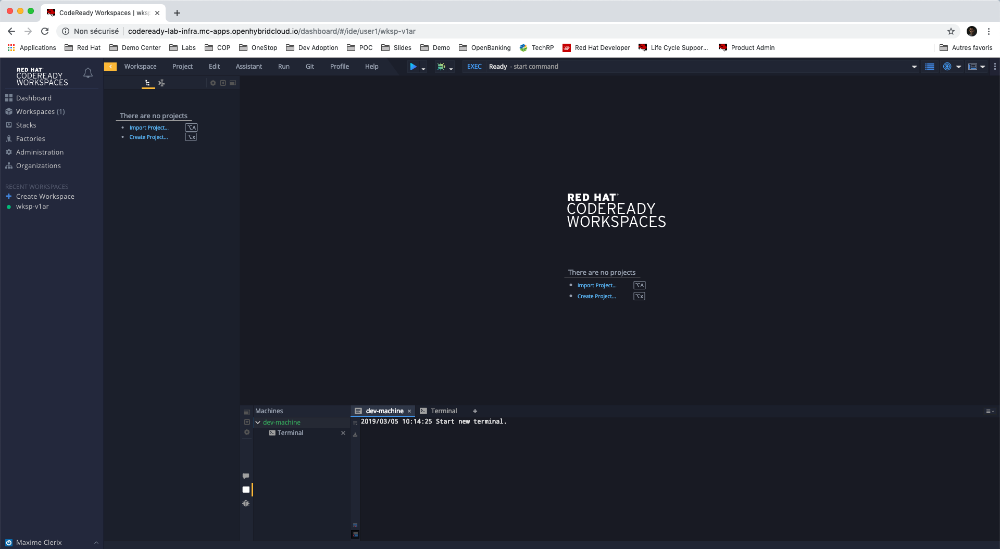
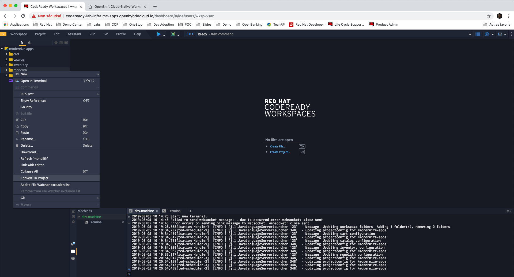
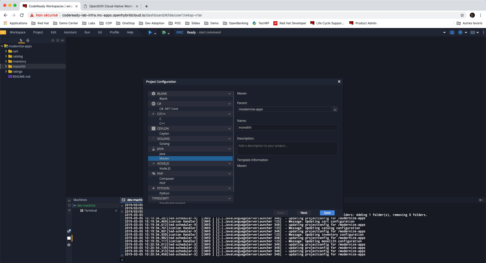
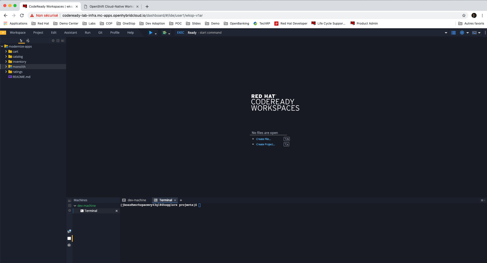
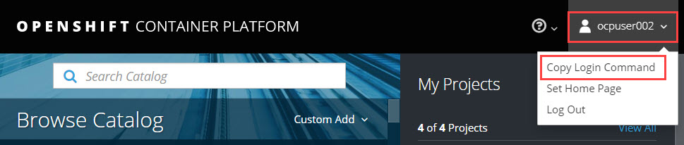

## Getting Started with OpenShift

In this lab you will get familiar with the OpenShift CLI and OpenShift Web Console
and get ready for the Application Modernization labs.

For completing the following labs, you can either use your own workstation or as an
alternative, CodeReady Workspaces web IDE. The advantage of your own workstation is that you use the
environment that you are familiar with while the advantage of CodeReady Workspaces is that all
tools needed (Maven, Git, OpenShift CLI, etc ) are pre-installed in it (not on your workstation!) and all interactions
takes place within the browser which removes possible internet speed issues and version incompatibilities
on your workstation.

The choice is yours but whatever you pick, like most things in life, stick with it for all the labs. We
ourselves are in love with CodeReady Workspaces and highly recommend it.

## Login to OpenShift web console

OpenShift ships with a web-based console that will allow users to
perform various tasks via a browser.  To get a feel for how the web console
works, open your browser and go to the ***OpenShift Web Console url** provided in the environment details page.

The first screen you will see is the authentication screen. Enter your **Azure username** and **Azure password** and
then log in.

This is the OpenShift console, your visual point of access and management to your OpenShift cluster. CodeReady Workspaces and your deployment environment, both, run on this OpenShift cluster.

## Setup Your Workspace on CodeReady Workspaces

Follow these instructions to setup the development environment on CodeReady Workspaces.

You might be familiar with the Eclipse IDE which is one of the most popular IDEs for Java and other
programming languages. [CodeReady Workspaces](https://www.eclipse.org/che/) is the next-generation Eclipse IDE which is web-based
and gives you a full-featured IDE running in the cloud. You have an CodeReady Workspaces instance deployed on your OpenShift cluster
which you will use during these labs.

Go to the **CodeReady Workspaces url** in order to configure your development workspace

Log into CodeReady Workspaces with your user account (you can find the username and password in the environment details page).

   > If you get the error message "Failed to load plugins", ignore that.

Click on the workspace shown in the **Recent Workspaces** section. Once there, click the **Open** button in the top right corner.

It takes a little while for the workspace to be ready. When it's ready, you will see a fully functional
CodeReady Workspaces IDE running in your browser.

<kbd></kbd>

This would be the point at which you would import the project skeletons into your workspace. For this lab, the projects are already imported into your workspace and are visible in the project explorer

Codeready Workspaces is a full featured IDE and provides language specific capabilities for various project types. In order to
enable these capabilities, let's convert the imported project skeletons to a Maven projects.

In the project explorer, right-click on **monolith** and then click on **Convert to Project**.

<kbd></kbd>

Choose **Maven** from the project configurations and then click on **Save**

<kbd></kbd>

Repeat the above for **cart**, **catalog**, **inventory** projects.

Note the **Terminal** window in Codeready Workspaces. For the rest of these labs, anytime you need to run
a command in a terminal, you can use the Codeready Workspaces **Terminal** window.

<kbd></kbd>

## Explore OpenShift with OpenShift CLI

In order to login, we will use the `oc` command and then specify the server that we
want to authenticate to.

Go to your OpenShift console and click on your username icon on the top right of the screen to open up the pop-down menu and then select **"Copy Login Command"**. This will copy the entire login command, including your login token, to your clipboard.
Then, go to the CodeReady Workspaces Terminal window and paste the login command you copied in the previous step, and press **enter**

<kbd></kbd>

You may see the following output:

~~~shell
The server uses a certificate signed by an unknown authority.
You can bypass the certificate check, but any data you send to the server could be intercepted by others.
Use insecure connections? (y/n):
~~~

Enter in `Y` to use a potentially insecure connection.  The reason you received
this message is because we are using a self-signed certificate for this
workshop, but we did not provide you with the CA certificate that was generated
by OpenShift. In a real-world scenario, either OpenShift's certificate would be
signed by a standard CA (eg: Thawte, Verisign, StartSSL, etc.) or signed by a
corporate-standard CA that you already have installed on your system.

Congratulations, you are now authenticated to the OpenShift server.

Now you are ready to get started with the labs!
