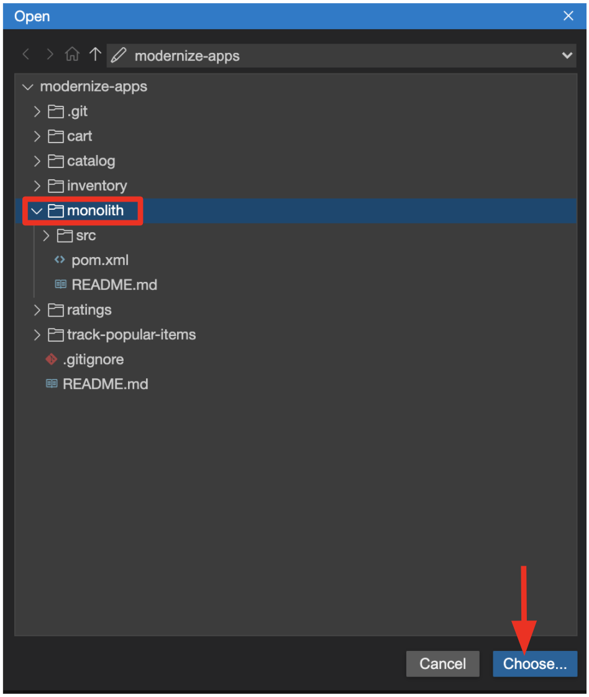
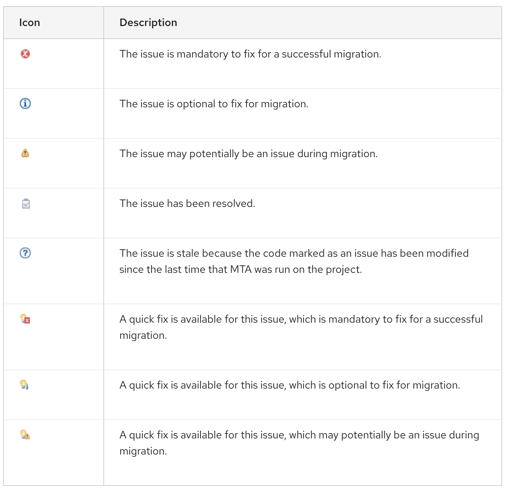
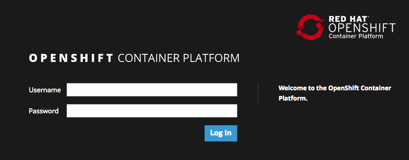
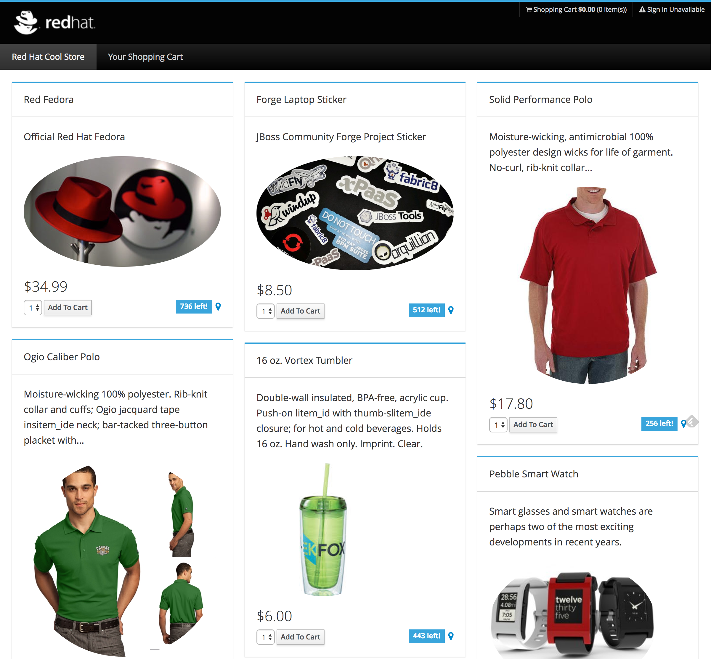

# SCENARIO 1: Moving existing apps to the cloud

* Purpose:
* Difficulty: `intermediate`
* Time: `45 minutes`

## Intro
In this scenario you will see how easy it is to migrate from legacy platforms to JBoss EAP.
We'll answer questions like:

* Why move applications to OCP and cloud?
* What does the lift and shift process look like?

We will then take the following steps to migrate (lift & shift) an existing Java EE app to EAP+OpenShift using [Red Hat Migration Toolkit for Applications](https://developers.redhat.com/products/mta/overview) (RHMTA)

* Analyze existing WebLogic monolith application using RHMTA directly in the CodeReady Workspaces IDE
* Review the report and update code and config to run on JBoss EAP
* Deploy to OpenShift
* Use OpenShift features like automatic clustering and failover to enhance the application

## What is Red Hat Migration Toolkit for Applications?

Red Hat Migration Toolkit for Applications (RHMTA) is an extensible and customizable rule-based tool that helps simplify migration of Java applications.

It is used by organizations for:

* Planning and work estimation
* Identifying migration issues and providing solutions
* Detailed reporting
* Using built-in rules and migration paths
* Rule extension and customizability
* Ability to analyze source code or application archives

RHMTA examines application artifacts, including project source directories and application archives, then produces an HTML report that highlights areas needing changes. RHMTA can be used to migrate Java applications from previous versions of Red Hat JBoss Enterprise Application Platform or from other containers, such as Oracle® WebLogic Server or IBM® WebSphere® Application Server.

## How Does RHMTA Simplify Migration?

RHMTA looks for common resources and highlights technologies and known trouble spots when migrating applications. The goal is to provide a high-level view into the technologies used by the application and provide a detailed report organizations can use to estimate, document, and migrate enterprise applications to Java EE and Red Hat JBoss Enterprise Application Platform.

> RHMTA is usually part of a much larger application migration and modernization program that involves well defined and repeatable phases over weeks or months and involves many people from a given business. Do not be fooled into thinking that every single
migration is a simple affair and takes an hour or less! To learn more about Red Hat's philosophy and proven methodology, check out
the [RHMTA documentation](https://access.redhat.com/documentation/en-us/migration_toolkit_for_applications) and contact your local Red Hat representative when embarking on a real world migration and modernization strategy.

## More RHMTA Resources

* [Documentation](https://access.redhat.com/documentation/en-us/migration_toolkit_for_applications)
* [Developer Homepage](https://developers.redhat.com/products/mta/overview)

## Analyzing a Java EE app using Red Hat Application Migration Toolkit

In this step we will analyze an existing application built for use with
Oracle® WebLogic Server (WLS). This application is a Java EE application
using a number of different technologies, including standard Java EE APIs
as well as proprietary Weblogic APIs and best practices.

**1. MTA IDE Plugin**

For this lab, we will use the [MTA Plugin]( https://access.redhat.com/documentation/en-us/migration_toolkit_for_applications/5.0/html-single/ide_plugin_guide/index) based on CodeReady Workspaces.

The IDE Plugin for the Migration Toolkit for Applications provides assistance directly in Eclipse and Red Hat CodeReady Studio/Workspaces for developers making changes for a migration or modernization effort. It analyzes your projects using MTA, marks migration issues in the source code, provides guidance to fix the issues, and offers automatic code replacement when possible.

**2. Use the configuration editor to setup the analysis**

Click on `MTA Explorer` icon on the left, click on `+` icon to add a new MTA configuration:

> NOTE: If you don't see '+' icon, please try to `uncheck` *Explorer* via right-clicking on _MIGRATION TOOLKIT FOR APPLICATIONS_ menu then `check` it again.

To input source files and directories, on the `--input` option click on `Add` then select `Open File Explorer`:

Navigate to `projects > modernize-apps` then select `monolith` directory. Click on `Choose...`:

Then you will see that */projects/mdoernize-apps/monoilth* directory is added in _--input_ configuration.

Select `eap7` in _--target_ server to migrate:

Click on `--source` to migrate from then select `weblogic`. Leave the other configurations:

**3. Run an analysis report**

Right-click on *mtaConfiguration* to analyze the WebLogic application. Click on `Run` in the popup menu:

Migration Toolkit for Applications (MTA) CLI will be executed automatically in a new terminal then it will take a few minutes to complete the analysis. Click on `Open Report`:

**4. Review the report**

The main landing page of the report lists the applications that were processed. Each row contains a high-level overview of the
story points, number of incidents, and technologies encountered in that application.

**Click on the `monolith` link** to access details for the project:

**5. Understanding the report**

The Dashboard gives an overview of the entire application migration effort. It summarizes:

* The incidents and story points by category
* The incidents and story points by level of effort of the suggested changes
* The incidents by package

> *NOTE:* _Story points_ are an abstract metric commonly used in Agile software development to estimate the relative level of effort needed to
implement a feature or change. Migration Toolkit for Application uses story points to express the level of effort needed to
migrate particular application constructs, and the application as a whole. The level of effort will vary greatly depending on the
size and complexity of the application(s) to migrate.

You can use this report to estimate how easy/hard each app is, and make decisions about which apps to migrate, which to refactor, and which to leave alone. In this case we will do a straight migration to JBoss EAP.

On to the next step to change the code!

**6. Jump to Code**

Let's jump to code containing identified migration issues. Expand the *monolith* source project in the MTA explorer and navigate to `modernize-apps > monolith > src > main > java > com > redhat > coolstore > utils > StartupListener.java`. Be sure to click the arrow next to the actual class name `StartupListener.java` to expand and show the Hints:

In the Explorer, MTA issues use an icon to indicate their severity level and status. The following table describes the meaning of the various icons:

**7. View Details about the Migration Issues**

Let's take a look at the details about the migration issue. Right-click on `WebLogic ApplicationLifecycleListenerEvent[rule-id:xxx]` in _Hints_ of _StartupListener.java_ file. Click on `View Details`:

MTA also provides helpful links to understand the issue deeper and offer guidance for the migration when you click on `Open Report`:

The WebLogic `ApplicationLifecycleListener` abstract class is used to perform functions or schedule jobs in Oracle WebLogic, like server start and stop. In this case we have code in the `postStart` and `preStop` methods which are executed after Weblogic starts up and before it shuts down, respectively.

In Jakarta EE, there is no equivalent to intercept these events, but you can get equivalent
functionality using a _Singleton EJB_ with standard annotations, as suggested in the issue in the MTA report.

We will use the `@Startup` annotation to tell the container to initialize the singleton session bean at application start. We
will similarly use the `@PostConstruct` and `@PreDestroy` annotations to specify the methods to invoke at the start and end of
the application lifecyle achieving the same result but without using proprietary interfaces.

Using this method makes the code much more portable.

**8. Fix the ApplicationLifecycleListener issues**

To begin we are fixing the issues under the Monolith application. Right-click on `WebLogic ApplicationLifecycleListenerEvent[rule-id:xxx]` in _Hints_ of _StartupListener.java_ file. Click on `Open Code`:

You can also navigate to the `modernize-apps` folder in the project tree, then open the file `monolith/src/main/java/com/redhat/coolstore/utils/StartupListener.java` by clicking on it.

Replace the file content with the below code by selecting all existing code with CTRL-A or CMD-A, pressing BACKSPACE, then copying pasting this code in:

~~~java
package com.redhat.coolstore.utils;

import javax.annotation.PostConstruct;
import javax.annotation.PreDestroy;
import javax.ejb.Startup;
import javax.inject.Singleton;
import javax.inject.Inject;
import java.util.logging.Logger;

@Singleton
@Startup
public class StartupListener {

    @Inject
    Logger log;

    @PostConstruct
    public void postStart() {
        log.info("AppListener(postStart)");
    }

    @PreDestroy
    public void preStop() {
        log.info("AppListener(preStop)");
    }

}
~~~

> *NOTE:* Where is the Save button? CodeReady workspaces will autosave your changes, that is why you can’t find a SAVE button - no
more losing code because you forgot to save. You can undo with `CTRL-Z` (or CMD-Z on a Mac) or by using the `Edit -> Undo` menu option.

**9. Test the build**

Open a new Terminal window under the `maven3-jdk11` container (on the right). In the terminal, issue the following command to test the build:

~~~sh
mvn -f $CHE_PROJECTS_ROOT/modernize-apps/monolith clean package
~~~

If it builds successfully (you will see `BUILD SUCCESS`), let’s move on to the next issue! If it does not compile, verify
you made all the changes correctly and try the build again.

**10. View the diffs**

You can review the changes you've made. On the left, click on the _Version Control_ icon, which shows a list of the changed files. Double-click on `StartupListener.java` to view the differences you've made:

CodeReady keeps track (using Git) of the changes you make, and you can use version control to check in, update, and compare files as you change them.

For now, go back to the _Explorer_ tree and lets fix the remaining issues.

**11. Fix the logger issues**

Some of our application makes use of Weblogic-specific logging methods like the `NonCatalogLogger`, which offer features related to logging of
internationalized content, and client-server logging.

The WebLogic `NonCatalogLogger` is not supported on JBoss EAP (or any other Jakarta EE platform), and should be migrated to a
supported logging framework, such as the JDK Logger or JBoss Logging.

We will use the standard Java Logging framework, a much more portable framework. The framework also [supports
internationalization](https://docs.oracle.com/javase/8/docs/technotes/guides/logging/overview.html#a1.17) if needed.

Go back to the File Exporer:

In the same `monolith` directory, open the `src/main/java/com/redhat/coolstore/service/OrderServiceMDB.java` file and replace its contents with:

~~~java
package com.redhat.coolstore.service;

import javax.ejb.ActivationConfigProperty;
import javax.ejb.MessageDriven;
import javax.inject.Inject;
import javax.jms.JMSException;
import javax.jms.Message;
import javax.jms.MessageListener;
import javax.jms.TextMessage;

import com.redhat.coolstore.model.Order;
import com.redhat.coolstore.utils.Transformers;

import java.util.logging.Logger;

@MessageDriven(name = "OrderServiceMDB", activationConfig = {
    @ActivationConfigProperty(propertyName = "destinationLookup", propertyValue = "topic/orders"),
    @ActivationConfigProperty(propertyName = "destinationType", propertyValue = "javax.jms.Topic"),
    @ActivationConfigProperty(propertyName = "acknowledgeMode", propertyValue = "Auto-acknowledge")})
public class OrderServiceMDB implements MessageListener {

    @Inject
    OrderService orderService;

    @Inject
    CatalogService catalogService;

    private Logger log = Logger.getLogger(OrderServiceMDB.class.getName());

    @Override
    public void onMessage(Message rcvMessage) {
        TextMessage msg = null;
        try {
                if (rcvMessage instanceof TextMessage) {
                        msg = (TextMessage) rcvMessage;
                        String orderStr = msg.getBody(String.class);
                        log.info("Received order: " + orderStr);
                        Order order = Transformers.jsonToOrder(orderStr);
                        log.info("Order object is " + order);
                        orderService.save(order);
                        order.getItemList().forEach(orderItem -> {
                            catalogService.updateInventoryItems(orderItem.getProductId(), orderItem.getQuantity());
                        });
                }
        } catch (JMSException e) {
            throw new RuntimeException(e);
        }
    }

}
~~~

That one was pretty easy.

**12. Test the build**

Build and package the app again just as before:

~~~sh
mvn -f $CHE_PROJECTS_ROOT/modernize-apps/monolith clean package
~~~

If builds successfully (you will see `BUILD SUCCESS`), then let’s move on to the next issue! If it does not compile, verify you
made all the changes correctly and try the build again.

**13. Fix issues with MDBs**

In this final step we will again migrate some Weblogic-specific code in the app to use standard Java EE interfaces, and one
JBoss-specific interface.

Our application uses [JMS](https://en.wikipedia.org/wiki/Java_Message_Service) to
communicate. Each time an order is placed in the application, a JMS message is sent to a JMS Topic, which is then consumed by
listeners (subscribers) to that topic to process the order using
[Message-driven beans](https://docs.oracle.com/javaee/6/tutorial/doc/gipko.html), a form of
Enterprise JavaBeans (EJBs) that allow Java EE applications to process messages asynchronously.

In this case, `InventoryNotificationMDB` is subscribed to and listening for messages from `ShoppingCartService`. When an order
comes through the `ShoppingCartService`, a message is placed on the JMS Topic. At that point, the `InventoryNotificationMDB`
receives a message and if the inventory service is below a pre-defined threshold, sends a message to the log indicating that the
supplier of the product needs to be notified.

Unfortunately this MDB was written a while ago and makes use of weblogic-proprietary interfaces to configure and operate the MDB.
MTA has flagged this and reported it using a number of issues.

JBoss EAP provides an even more efficient and declarative way to configure and manage the lifecycle of MDBs. In this case, we can
use annotations to provide the necessary initialization and configuration logic and settings. We will use the `@MessageDriven`
and `@ActivationConfigProperty` annotations, along with the `MessageListener` interfaces to provide the same functionality as
from Weblogic.

Much of Weblogic’s interfaces for EJB components like MDBs reside in Weblogic descriptor XML files. Open
`src/main/webapp/WEB-INF/weblogic-ejb-jar.xml` to see one of these descriptors. There are many different configuration
possibilities for EJBs and MDBs in this file, but luckily our application only uses one of them, namely it configures
`<trans-timeout-seconds>` to 30, which means that if a given transaction within an MDB operation takes too long to complete
(over 30 seconds), then the transaction is rolled back and exceptions are thrown. This interface is Weblogic-specific so we’ll
need to find an equivalent in JBoss.

> **NOTE:** You should be aware that this type of migration is more involved than the previous steps, and in real world applications it will
rarely be as simple as changing one line at a time for a migration. Consult the
[MTA documentation](https://access.redhat.com/documentation/en-us/migration_toolkit_for_applications/) for more
detail on Red Hat’s Application Migration strategies or contact your local Red Hat representative to learn more about how Red Hat
can help you on your migration path.

**14. Review the issues**

From the MTA Issues report, we will fix the remaining issues:

* `Call of JNDI lookup` - Our apps use a weblogic-specific [JNDI](https://en.wikipedia.org/wiki/Java_Naming_and_Directory_Interface) lookup scheme.
* `Proprietary InitialContext initialization` - Weblogic has a very different lookup mechanism for InitialContext objects
* `WebLogic InitialContextFactory` - This is related to the above, essentially a Weblogic proprietary mechanism
* `WebLogic T3 JNDI binding` - The way EJBs communicate in Weblogic is over T2, a proprietary implementation of Weblogic.

All of the above interfaces have equivalents in JBoss, however they are greatly simplified and overkill for our application which
uses JBoss EAP’s internal message queue implementation provided by [Apache ActiveMQ
Artemis](https://activemq.apache.org/artemis/).

**15. Remove the weblogic EJB Descriptors**

The first step is to remove the unneeded `weblogic-ejb-jar.xml` file. This file is proprietary to Weblogic and not recognized or
processed by JBoss EAP. Delete the file by right-clicking on the `src/main/webapp/WEB-INF/weblogic-ejb-jar.xml` file and choose **Delete**, and click **OK**.

While we’re at it, let’s remove the stub weblogic implementation classes added as part of the scenario.

Right-click on the `src/main/java/weblogic` folder and select *Delete* to delete the folder:

**16. Fix the code**

Open the `monolith/src/main/java/com/redhat/coolstore/service/InventoryNotificationMDB.java` file and replace its contents with:

~~~java
package com.redhat.coolstore.service;

import com.redhat.coolstore.model.Order;
import com.redhat.coolstore.utils.Transformers;

import javax.ejb.ActivationConfigProperty;
import javax.ejb.MessageDriven;
import javax.inject.Inject;
import javax.jms.JMSException;
import javax.jms.Message;
import javax.jms.MessageListener;
import javax.jms.TextMessage;
import java.util.logging.Logger;

@MessageDriven(name = "InventoryNotificationMDB", activationConfig = {
        @ActivationConfigProperty(propertyName = "destinationLookup", propertyValue = "topic/orders"),
        @ActivationConfigProperty(propertyName = "destinationType", propertyValue = "javax.jms.Topic"),
        @ActivationConfigProperty(propertyName = "transactionTimeout", propertyValue = "30"),
        @ActivationConfigProperty(propertyName = "acknowledgeMode", propertyValue = "Auto-acknowledge")})
public class InventoryNotificationMDB implements MessageListener {

    private static final int LOW_THRESHOLD = 50;

    @Inject
    private CatalogService catalogService;

    @Inject
    private Logger log;

    public void onMessage(Message rcvMessage) {
        TextMessage msg;
        {
            try {
                if (rcvMessage instanceof TextMessage) {
                    msg = (TextMessage) rcvMessage;
                    String orderStr = msg.getBody(String.class);
                    Order order = Transformers.jsonToOrder(orderStr);
                    order.getItemList().forEach(orderItem -> {
                        int old_quantity = catalogService.getCatalogItemById(orderItem.getProductId()).getInventory().getQuantity();
                        int new_quantity = old_quantity - orderItem.getQuantity();
                        if (new_quantity < LOW_THRESHOLD) {
                            log.warning("Inventory for item " + orderItem.getProductId() + " is below threshold (" + LOW_THRESHOLD + "), contact supplier!");
                        }
                    });
                }

            } catch (JMSException jmse) {
                System.err.println("An exception occurred: " + jmse.getMessage());
            }
        }
    }
}
~~~

Remember the `<trans-timeout-seconds>` setting from the `weblogic-ejb-jar.xml` file? This is now set as an
`@ActivationConfigProperty` in the new code. There are pros and cons to using annotations vs. XML descriptors and care should be
taken to consider the needs of the application.

Your MDB should now be properly migrated to JBoss EAP.

Lastly, remove Maven dependency on *org.jboss.spec.javax.rmi:jboss-rmi-api_1.0_spec*. In JBoss EAP 7.3(or later), artifact with groupId _org.jboss.spec.javax.rmi_ and artifactId _jboss-rmi-api_1.0_spec_ are unneeded dependencies. Remove the following dependency in `monolith/pom.xml`:

**17. Test the build**

Build once again:

~~~sh
mvn -f $CHE_PROJECTS_ROOT/modernize-apps/monolith clean package
~~~

If builds successfully (you will see `BUILD SUCCESS`). If it does not compile, verify you
made all the changes correctly and try the build again.

**18. Re-run the MTA report**

In this step we will re-run the MTA report to verify our migration was successful.

In the MTA explorer, right-click on *mtaConfiguration* to analyze the WebLogic application once again. Click on `Run` in the popup menu:

Migration Toolkit for Applications (MTA) CLI will be executed automatically in a new terminal then it will take a few mins to complete the analysis. Click on `Open Report`:

> **NOTE:** If it is taking too long, feel free to skip the next section and proceed to step *13* and return back to the analysis later to confirm that you
eliminated all the issues.

**19. View the results**

Click on the latest result to go to the report web page and verify that it now reports `0 Story Points`:

You have successfully migrated this app to JBoss EAP, congratulations!

Now that we’ve migrated the app, let’s deploy it and test it out and start to explore some of the features that JBoss EAP plus Red
Hat OpenShift bring to the table.

## Migrate and run the project

Now that we migrated the application you are probably eager to test it. To test it locally, JBoss EAP 7.2 has already been downloaded. We just need to install it.

Run the following command in the terminal window.
~~~sh
unzip -d $HOME $HOME/jboss-eap-7.2.0.zip
~~~
We should also set the JBOSS_HOME environment variable like this:
~~~sh
export JBOSS_HOME=$HOME/jboss-eap-7.2
~~~
Done! That is how easy it is to install JBoss EAP.

Open the `pom.xml` file.
Navigate to your CodeReady Workspace File Explorer and expand the `modernize-apps` directory to the following file:
`monolith/pom.xml`. Double click on **pom.xml** to open the file

## The maven-wildfly-plugin
JBoss EAP comes with a nice maven-plugin tool that can stop, start, deploy, and configure JBoss EAP directly from Apache Maven. Let's add that the pom.xml file.

At the `TODO: Add wildfly plugin here` we are going to add a the following configuration

~~~xml
<plugin>
    <groupId>org.wildfly.plugins</groupId>
    <artifactId>wildfly-maven-plugin</artifactId>
    <version>2.0.2.Final</version>
    <!-- TODO: Add configuration here -->
</plugin>
~~~

Next we are going to add some configuration at the `TODO: Add configuration here` marker. First we need to point to our JBoss EAP installation using the `jboss-home` configuration. After that we will also have to tell JBoss EAP to use the profile configured for full Java
EE, since it defaults to use the Java EE Web Profile. This is done by adding a `server-config` and set it to value `standalone-full.xml`

~~~xml
<configuration>
    <jboss-home>${env.JBOSS_HOME}</jboss-home>
    <server-config>standalone-full.xml</server-config>
    <resources>
<!-- TODO: Add Datasource definition here -->
<!-- TODO: Add JMS Topic definition here -->
    </resources>
    <server-args>
        <server-arg>-Djboss.https.port=8888</server-arg>
        <server-arg>-Djboss.bind.address=0.0.0.0</server-arg>
    </server-args>
    <javaOpts>-Djava.net.preferIPv4Stack=true</javaOpts>
</configuration>
~~~

Since our application is using a Database we also configure that by adding the following at the `<-- TODO: Add Datasource definition here -->` comment

~~~xml
<resource>
    <addIfAbsent>true</addIfAbsent>
    <address>subsystem=datasources,data-source=CoolstoreDS</address>
    <properties>
        <jndi-name>java:jboss/datasources/CoolstoreDS</jndi-name>
        <enabled>true</enabled>
        <connection-url>jdbc:h2:mem:test;DB_CLOSE_DELAY=-1</connection-url>
        <driver-class>org.h2.Driver</driver-class>
        <driver-name>h2</driver-name>
        <user-name>sa</user-name>
        <password>sa</password>
    </properties>
</resource>
~~~

Since our application is using a JMS Topic we also need to add the configuration for that by adding the following at the `<-- TODO: Add JMS Topic definition here -->` comment

~~~xml
<resource>
    <address>subsystem=messaging-activemq,server=default,jms-topic=orders</address>
    <properties>
        <entries>!!["topic/orders"]</entries>
    </properties>
</resource>
~~~

We are now ready to build and test the project.

## Configuring JBoss EAP

Our application is at this stage pretty standards based, but it needs two things. One is the need to add the JMS Topic since our application depends on it. In the CodeReady Workspaces Terminal window, Run the following command

~~~sh
export JBOSS_HOME=$HOME/jboss-eap-7.2 ; mvn -f $CHE_PROJECTS_ROOT/modernize-apps/monolith wildfly:start wildfly:add-resource wildfly:shutdown
~~~

> **NOTE**: You can ignore and dismiss the popups about port `8080-tcp` or other ports for now. We'll use that later.

Wait for a `BUILD SUCCESS` message. If it fails, check that you made all the correct changes and try again!

> NOTE: The reason we are using `wildfly:start` and `wildfly:shutdown` is because the `add-resource` command requires a running server. After we have added these resource we don't have to run this command again.

## Deploying the application

We are now ready to deploy the application. In the Codeready workspace terminal window, Run the following command:

~~~shell
export JBOSS_HOME=$HOME/jboss-eap-7.2 ; mvn -f $CHE_PROJECTS_ROOT/modernize-apps/monolith wildfly:run
~~~

Wait for the server to startup. You should see `Deployed "ROOT.war" (runtime-name: "ROOT.war")`

## Open the Web view

When JBoss EAP starts up, CodeReady notices that it opens ports and offers to open them in a preview window. Click on **Open In Preview** for the `8080-tcp` port to open the embedded web browser and ensure the coolstore is working (ignore/dismiss the other popups):

You should see:

Click on the link next to the address bar to open the same view in a full browser tab:

## Shutdown the application

Before moving on, in the Terminal window from which you started JBoss EAP, type `CTRL-C` to stop and terminate the process.

## Deploy the monolith to OpenShift

We now have a fully migrated application that we tested locally. Let's deploy it to OpenShift.

**1. Add a OpenShift profile**

Open the `modernize-apps/monolith/pom.xml` file.

At the `<!-- TODO: Add OpenShift profile here -->` we are going to add the following configuration to the pom.xml

~~~xml
<profile>
  <id>openshift</id>
  <build>
      <plugins>
          <plugin>
              <artifactId>maven-war-plugin</artifactId>
              <version>2.6</version>
              <configuration>
                  <webResources>
                      <resource>
                          <directory>${basedir}/src/main/webapp/WEB-INF</directory>
                          <filtering>true</filtering>
                          <targetPath>WEB-INF</targetPath>
                      </resource>
                  </webResources>
                  <outputDirectory>/projects/modernize-apps/monolith/deployments</outputDirectory>
                  <warName>ROOT</warName>
              </configuration>
          </plugin>
      </plugins>
  </build>
</profile>
~~~

**2. Create the OpenShift project**

First, navigate to the OpenShift console URL (if you closed the one you had opened earlier, open a new browser window and enter the URL provided to you).

<kbd></kbd>

Login using:

* Username: provide the openshift cluster username from the lab details page.
* Password: provide the openshift cluster password from the lab details page.

Click **Skip Tour** to dismiss the intro popup about an OpenShift tour.

You will then see the OpenShift landing page:

<kbd></kbd>

You will be placed on the OpenShift _Dev Perspective_. You can freely switch between _Developer_ and _Administrator_ perspective using the menu on the left:

Open the _Project_ drop-down menu, select **Create Project**, fill in the fields, and click **Create** (make sure to replace XX with your assigned number):

* Name: `ocpuser0XX-coolstore-dev`
* Display Name: `Coolstore Monolith - Dev`
* Description: _leave this field empty_

> **NOTE**: YOU **MUST** USE `ocpuser0XX-coolstore-dev` AS THE PROJECT NAME, as this name is referenced later
on and you will experience failures if you do not name it `ocpuser0XX-coolstore-dev`!

There's nothing there yet, but that's about to change.

**3. Deploy the monolith**

We'll use the CLI to deploy the components for our monolith. We will enter the CLI commands from the CodeReady Workspaces Terminal window. Before issuing these CLI commands, remember to log in to the OpenShift cluster by following the instructions from the "Introduction" lab you completed earlier. To deploy the monolith template using the CLI, execute the following commands:

From the CodeReady Workspaces Terminal window, switch to the dev project you created earlier:

`oc project ocpuser0XX-coolstore-dev`

Run the below commands one by one to import all the required images and the template in to our namespace.

~~~sh
oc create -n ocpuser0XX-coolstore-dev -f https://raw.githubusercontent.com/faizyorg/modernize-apps-labs/master/monolith/src/main/openshift/template-binary.json
~~~

And finally deploy template:

~~~sh
oc new-app coolstore-monolith-binary-build
~~~

This will initialize our EAP application, but it will not start a build for our application.

You can see the components deployed on the topology view, but note that **coolstore** has 0 pods. You have not yet deployed the container image built in previous steps, but you'll do that next.

<kbd></kbd>

**4. Deploy application using Binary build**

In this development project we have selected to use a process called binary builds, which means that instead of pointing to a public Git Repository and have the S2I (Source-to-Image) build process download, build, and then create a container image for us we are going to build locally and just upload the artifact (e.g. the `.war` file). The binary deployment will speed up the build process significantly.

First, build the project once more using the `openshift` Maven profile, which will create a suitable binary for use with OpenShift (this is not a container image yet, but just the `.war` file). We will do this with the `oc` command line.

From the CodeReady Workspaces Terminal window, build the project:

~~~shell
mvn -f $CHE_PROJECTS_ROOT/modernize-apps/monolith clean package -Popenshift
~~~

Wait for the build to finish and the `BUILD SUCCESS` message!

And finally, start the build process that will take the `.war` file and combine it with JBoss EAP and produce a Linux container image which will be automatically deployed into the project, thanks to the *DeploymentConfig* object created from the template:

~~~shell
oc start-build coolstore --from-file=$CHE_PROJECTS_ROOT/modernize-apps/monolith/deployments/ROOT.war
~~~

Check the OpenShift web console and you'll see the application being built:

Wait for the build and deploy to complete (the circle will turn dark blue).

You can also confirm the rollout is complete using this command in a CodeReady Workspaces terminal:

~~~sh
oc rollout status -w dc/coolstore
~~~

This command will be used often to wait for deployments to complete. Be sure it returns success when you use it!
You should eventually see `replication controller "coolstore-1" successfully rolled out`.

> If the above command reports `Error from server (ServerTimeout)` then simply re-run the command until it reports success!

To test the application, Click on the "Route" link in the Topology view:

This will open the same monolith Coolstore in your browser, this time running on OpenShift:

> **NOTE**: If it does not show up, simply wait a few moments and reload your browser. As we have no health probes in place yet (this is coming later), the app may take some time to initialize.

## Congratulations!

Now you are using the same application that we built locally on OpenShift. That wasn't too hard right?

<kbd></kbd>

In the next step you'll explore more of the developer features of OpenShift in preparation for moving the monolith to a microservices architecture later on. Let's go!

## Summary

Now that you have migrated an existing Java EE app to the cloud
with JBoss and OpenShift, you are ready to start modernizing the
application by breaking the monolith into smaller microservices in
incremental steps, and employing modern techniques to ensure the
application runs well in a distributed and containerized environment.

But first, you'll need to dive a bit deeper into OpenShift and how
it supports the end-to-end developer workflow.
