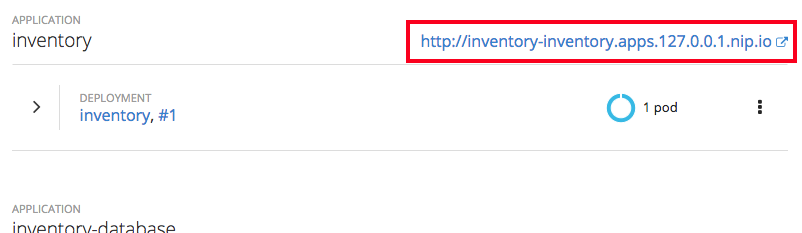

# SCENARIO 3: Transforming an existing monolith (Part 1)

* Purpose: Showing developers and architects how Red Hat jumpstarts modernization
* Difficulty: `intermediate`
* Time: `45 minutes`

## Intro
In the previous scenarios you learned how to take an existing monolithic Java EE application to the cloud with JBoss EAP and OpenShift, and you got a glimpse into the power of OpenShift for existing applications.

You will now begin the process of modernizing the application by breaking the application into multiple microservices using different technologies, with the eventual goal of re-architecting the entire application as a set of distributed microservices. Later on we'll explore how you can better manage and monitor the application after it is re-architected.

In this scenario you will learn more about [Quarkus](https://quarkus.io/), one of the runtimes included in [Red Hat Runtimes](https://www.redhat.com/en/products/runtimes). Quarkus is a great place to start since our application is a Java EE application, and your skills as a Java EE developer will naturally translate to the world of Quarkus.

You will implement one component of the monolith as a Qurkus microservice and modify it to address microservice concerns, understand its structure, deploy it to OpenShift and exercise the interfaces between Quarkus apps, microservices, and OpenShift/Kubernetes.

## Goals of this scenario

The goal is to deploy this new microservice alongside the existing monolith, and then later on we'll tie them together. But after this scenario, you should end up with something like:

<kbd></kbd>

## What is Quarkus

Quarkus is a full-stack, Kubernetes-native Java framework made for Java virtual machines (JVMs) and native compilation, optimizing Java specifically for containers and enabling it to become an effective platform for serverless, cloud, and Kubernetes environments.

Quarkus is designed to work with popular Java standards, frameworks, and libraries like Eclipse MicroProfile, Apache Kafka, RESTEasy (JAX-RS), Hibernate ORM (JPA), Spring, Infinispan, Camel, and many more. 

Quarkus’ dependency injection solution is based on CDI (contexts and dependency injection) and includes an extension framework to expand functionality and to configure, boot, and integrate a framework into your application. Adding an extension is as easy as adding a dependency, or you can use Quarkus tooling.

It also provides the correct information to GraalVM (a universal virtual machine for running apps written in a number of languages, including Java and JavaScript) for native compilation of your application.

## Setup for Exercise

To start in the right directory, from the CodeReady Workspaces Terminal, run the following command:
```
cd /projects/modernize-apps/inventory
```

## Examine the sample project

The sample project shows the components of a basic Quarkus project laid out in different subdirectories.

**1. Examine the Maven project structure.**

This is a minimal Java EE project with support for JAX-RS for building RESTful services and JPA for connecting to a database. [JAX-RS](https://docs.oracle.com/javaee/7/tutorial/jaxrs.htm) is one of Java EE standards that uses Java annotations to simplify the development of RESTful web services. [Java Persistence API (JPA)](https://docs.oracle.com/javaee/7/tutorial/partpersist.htm) is another Java EE standard that provides Java developers with an object/relational mapping facility for managing relational data in Java applications.

This project currently contains no code other than the main class for exposing a single RESTful application defined in `modernize-apps/inventory/src/main/java/com/redhat/coolstore/rest/RestApplication.java`.

Run the Maven build to make sure the skeleton project builds successfully. You should get a **BUILD SUCCESS** message in the logs, otherwise the build has failed.

> Make sure to run the **package** Maven goal and not **install**. The latter would download a lot more dependencies and do things you don't need yet!

~~~sh
mvn clean package
~~~~

You should see a **BUILD SUCCESS** in the logs.

Once built, the resulting *jar* is located in the **target** directory:

`ls target/*.jar`

The listed jar archive, **inventory-1.0.0-runner.jar** , is an uber-jar with all the dependencies required packaged in the *jar* to enable running the application with **java -jar**. Quarkus also creates a *war* packaging as a standard Java EE web app that could be deployed to any Java EE app server.

Now let's write some code and create a domain model, service interface and a RESTful endpoint to access inventory:

<kbd></kbd>

## Create Inventory Domain

With our skeleton project in place, let's get to work defining the business logic.

The first step is to define the model (definition) of an Inventory object. 

Using the CodeReady Workspaces File Explorer interface, create a new file named `Inventory.java` in directory `modernize-apps/inventory/src/main/java/com/redhat/coolstore/model` for the Inventory Java class in package `com.redhat.coolstore.model` with the following code, identical to the monolith code:

~~~java
package com.redhat.coolstore.model;

import javax.persistence.Entity;
import javax.persistence.Id;
import javax.persistence.Table;
import javax.persistence.UniqueConstraint;
import java.io.Serializable;

@Entity
@Table(name = "INVENTORY", uniqueConstraints = @UniqueConstraint(columnNames = "itemId"))
public class Inventory implements Serializable {

    private static final long serialVersionUID = -7304814269819778382L;

    @Id
    private String itemId;


    private String location;


    private int quantity;


    private String link;

    public Inventory() {

    }

    public Inventory(String itemId, int quantity, String location, String link) {
        super();
        this.itemId = itemId;
        this.quantity = quantity;
        this.location = location;
        this.link = link;
    }

    public String getItemId() {
		return itemId;
	}

	public void setItemId(String itemId) {
		this.itemId = itemId;
	}

	public String getLocation() {
		return location;
	}

	public void setLocation(String location) {
		this.location = location;
	}

	public int getQuantity() {
		return quantity;
	}

	public void setQuantity(int quantity) {
		this.quantity = quantity;
	}

	public String getLink() {
		return link;
	}

	public void setLink(String link) {
		this.link = link;
	}

	@Override
    public String toString() {
        return "Inventory [itemId=" + itemId + ", availability=" + quantity + "/" + location + " link=" + link + "]";
    }
}
~~~

Review the **Inventory** domain model. annotate your entities with **@Entity** and any other mapping annotation as usual, **@Table** customizes the table creation process by defining a table name and database constraint and **@Id** marks the primary key for the table.

When using Hibernate ORM in Quarkus, you don’t need to have a `persistence.xml` resource to configure it.

Using such a classic configuration file is an option, but unnecessary unless you have specific advanced needs; so we’ll see first how Hibernate ORM can be configured without a `persistence.xml` resource.

In Quarkus, you just need to:

add your configuration settings in `application.properties`.
An Azure PostgreSQL database is used in this scenario for local development and the openshift deployment.

Examine `modernize-apps/inventory/src/main/resources/application.properties` to see  the database connection details for this project. Also note that the configurations uses `modernize-apps/inventory/src/main/resources/load.sql` to import initial data into the database.

Open `modernize-apps/inventory/src/main/resources/application.properties` and update it with your `Azure PostgreSQL Host Name`, `Your User ID (ocpuser0XX)`, `PostgreSQL Username` and `Password`.

```
quarkus.datasource.url = jdbc:postgresql://{Azure PostgreSQL Host Name}:5432/{ocpuser0XX}?ssl=true&sslmode=require
quarkus.datasource.driver = org.postgresql.Driver
quarkus.datasource.username ={PostgreSQL Username}
quarkus.datasource.password = {PostgreSQL Password}

quarkus.hibernate-orm.database.generation=drop-and-create
quarkus.hibernate-orm.sql-load-script=load.sql
```

Build and package the Inventory service using Maven to make sure your code compiles:

~~~sh
mvn clean package
~~~~

If it builds successfully, continue to the next step to create a new service.

## Create Inventory Service

In this step we will mirror the abstraction of a service so that we can inject the Inventory service into various places (like a RESTful resource endpoint) in the future. This is the same approach that our monolith uses, so we can re-use this idea again. Create a new file named `InventoryService.java` in directory `modernize-apps/inventory/src/main/java/com/redhat/coolstore/service` for the InventoryServices Java class in package `com.redhat.coolstore.service` with the code below:

~~~java
package com.redhat.coolstore.service;

import com.redhat.coolstore.model.Inventory;
import java.util.List;

import javax.inject.Inject;
import javax.enterprise.context.Dependent;
import javax.persistence.EntityManager;
import javax.persistence.Query;

@Dependent
public class InventoryService {

    @Inject
    EntityManager entityManager;
   
    public InventoryService() {

    }

    public boolean isAlive() {
        return entityManager.createQuery("select 1 from Inventory i")
                .setMaxResults(1)
                .getResultList().size() == 1;
    }
    public Inventory getInventory(String itemId) {
        return entityManager.find(Inventory.class, itemId);
    }

    public List<Inventory> getAllInventory() {
        Query query = entityManager.createQuery("SELECT i FROM Inventory i");
        return query.getResultList();
    }
}
~~~

Review the **InventoryService** class and note the JPA annotations on this class:

Hibernate ORM is the de facto standard JPA implementation and offers you the full breadth of an Object Relational Mapper. It works beautifully in Quarkus.
Re-Build and package the Inventory service using Maven to make sure your code compiles:

~~~sh
mvn clean package
~~~~

You should see a **BUILD SUCCESS** in the build logs. If builds successfully, continue to the next step to create a new RESTful endpoint that uses this service.

## Create RESTful Endpoints

Dependency injection in Quarkus is based on ArC which is a CDI-based dependency injection solution tailored for Quarkus' architecture. You can learn more about it in the Contexts and Dependency Injection guide.

ArC comes as a dependency of quarkus-resteasy so you already have it handy. Create a new file named `InventoryEndpoint.java` in directory `modernize-apps/inventory/src/main/java/com/redhat/coolstore/rest` for the InventoryEndpoint Java class in `package com.redhat.coolstore.rest` with the following content:

~~~java
package com.redhat.coolstore.rest;

import java.io.Serializable;
import java.util.List;

import javax.enterprise.context.ApplicationScoped;
import javax.inject.Inject;
import javax.ws.rs.GET;
import javax.ws.rs.Path;
import javax.ws.rs.PathParam;
import javax.ws.rs.Produces;
import javax.ws.rs.core.MediaType;

import com.redhat.coolstore.model.Inventory;
import com.redhat.coolstore.service.InventoryService;
        
@ApplicationScoped
@Path("/inventory")
public class InventoryEndpoint implements Serializable {

    private static final long serialVersionUID = -7227732980791688773L;

    @Inject
    InventoryService inventoryService;

    @GET
    @Produces(MediaType.APPLICATION_JSON)
    public List<Inventory> getAll() {
        return inventoryService.getAllInventory();
    }

    @GET
    @Path("{itemId}")
    @Produces(MediaType.APPLICATION_JSON)
    public Inventory getAvailability(@PathParam("itemId") String itemId) {
        return inventoryService.getInventory(itemId);
    }

}
~~~

The above REST services defines two endpoints:

* `/services/inventory` that is accessible via **HTTP GET** which will return all known product Inventory entities as JSON
* `/services/inventory/<id>` that is accessible via **HTTP GET** at for example **/services/inventory/329299** with the last path parameter being the product id which we want to check its inventory status.

The code also injects our new **InventoryService** using the [CDI @Inject](https://docs.oracle.com/javaee/7/tutorial/partcdi.htm) annotation, which gives us a runtime handle to the service we defined in the previous steps that we can use to query the database when the RESTful APIs are invoked.

Build and package the Inventory service again using Maven:

~~~sh
mvn clean package
~~~~

You should see a **BUILD SUCCESS** in the build logs.

## Test Locally

Using the Quarkus maven plugin (predefined in pom.xml), you can conveniently run the application locally and test the endpoint by entering the following command in the CodeReady Workspaces Terminal window:
~~~sh
mvn quarkus:dev
~~~

> As an uber-jar, it could also be run with `java -jar target/inventory-1.0.0-runner.jar` but you don't need to do this now

Once the application is done initializing you should see:

~~~sh
INFO  [io.quarkus] (main) inventory 1.0.0 (running on Quarkus 1.2.0.Final) started in 8.811s. Listening on: http://0.0.0.0:8080
~~~

Running locally using `quarkus:dev` will use the Azure PostgreSQL database. 

**3. Test the application**

Open a second CodeReady Workspaces Terminal window (if a second one is not already open), Navigate to it and run the below command to see the html code deployed.

```
curl http://localhost:8080
```

This is a simple webpage that will access the inventory *every 2 seconds* and refresh the table of product inventories.

To see the raw JSON output using `curl`, you can open an new terminal window by clicking on the plus (+) icon on the terminal toolbar and then choose **Terminal**. Open a new terminal and run the test:

`curl http://localhost:8080/services/inventory/329299 ; echo`

You would see a JSON response like this:

~~~json
{"itemId":"329299","location":"Raleigh","quantity":736,"link":"http://maps.google.com/?q=Raleigh"}
~~~

The REST API returned a JSON object representing the inventory count for this product. Congratulations!

**4. Stop the application**

Before moving on, click in the first terminal window where Quarkus is running and then press `CTRL-Z` to stop the running application! This command will stop the running process and send it to the background. To terminate the process, you need to do a `kill %1` from the terminal window.

You should see something like:

~~~sh
INFO  [io.quarkus] (Quarkus Shutdown Thread) Quarkus stopped in 0.007s
~~~

This indicates the application is stopped.

## Congratulations

You have now successfully created your first microservice using Quarkus and implemented a basic RESTful API on top of the database. Most of the code is the same as was found in the monolith, demonstrating how easy it is to migrate existing monolithic Java EE applications to microservices using Quarkus.

In next steps of this scenario we will deploy our application to OpenShift Container Platform and then start adding additional features to take care of various aspects of cloud native microservice development.


## Navigate to OpenShift dev Project

We have already deployed our coolstore monolith to OpenShift, but now we are working on re-architecting it to be microservices-based.

In this step we will deploy our new Inventory microservice for our CoolStore application, so let's navigate back to `ocpuser0XX-coolstore-dev`

From the CodeReady Workspaces Terminal window, navigate back to `ocpuser0XX-coolstore-dev` project by entering the following command:
```
oc project ocpuser0XX-coolstore-dev
```

## Deploy to OpenShift

Let's deploy our new inventory microservice to OpenShift!

**1. Build and Deploy**

Red Hat Runtimes includes a powerful maven plugin that can take an existing Quarkus application and generate the necessary Kubernetes configuration. You can also add additional config, like ``src/main/fabric8/inventory-deployment.yml`` which defines the deployment characteristics of the app , but OpenShift supports a wide range of [Deployment configuration options](https://docs.openshift.org/latest/architecture/core_concepts/deployments.html) for apps).

Build and deploy the project using the following command, which will use the maven plugin to deploy:

~~~sh
cd /projects/modernize-apps/inventory
mvn fabric8:deploy -Popenshift
~~~

The build and deploy may take a minute or two. Wait for it to complete. You should see a **BUILD SUCCESS** at the end of the build output.

> **NOTE**: If you see messages like `Current reconnect backoff is 2000 milliseconds (T1)` you can safely ignore them, it is a known issue and is harmless.

After the maven build finishes it will take less than a minute for the application to become available. To verify that everything is started, run the following command and wait for it complete successfully:

~~~sh
oc rollout status -w dc/inventory
~~~

**3. Access the application running on OpenShift**

This sample project includes a simple UI that allows you to access the Inventory API. This is the same
UI that you previously accessed outside of OpenShift which shows the CoolStore inventory. Click on the
route URL at

`http://inventory-ocpuser0XX-coolstore-dev.{{ ROUTE_SUFFIX }}/services/inventory`
to access the sample UI.

> You can also access the application through the link on the OpenShift Web Console Overview page.

> **NOTE**: If you get a '404 Not Found' error, just reload the page a few times until the Inventory UI appears. This
is due to a lack of health check which you are about to fix!

The UI will refresh the inventory table every 2 seconds, as before.

Back on the OpenShift console, Navigate to _Applications_ -> _Deployments_ -> `inventory` and then click on the top-most `(latest)` deployment in the listing (most likely `#1` or `#2`):

<kbd></kbd>

Notice OpenShift is warning you that the inventory application has no health checks:

<kbd></kbd>

In the next steps you will enhance OpenShift's ability to manage the application lifecycle by implementing a _health check pattern_. By default, without health checks (or health _probes_) OpenShift considers services to be ready to accept service requests even before the application is truly ready or if the application is hung or otherwise unable to service requests. OpenShift must be _taught_ how to recognize that our app is alive and ready to accept requests.

## Add Health Check Fraction
### What is a Health Check?

A key requirement in any managed application container environment is the ability to determine when the application is in a ready state. Only when an application has reported as ready can the manager (in this case OpenShift) act on the next step of the deployment process. OpenShift makes use of various _probes_ to determine the health of an application during its lifespan. A _readiness_ probe is one of these mechanisms for validating application health and determines when an application has reached a point where it can begin to accept incoming traffic. At that point, the IP address for the pod is added to the list of endpoints backing the service and it can begin to receive requests. Otherwise traffic destined for the application could reach the application before it was fully operational resulting in error from the client perspective.

Once an application is running, there are no guarantees that it will continue to operate with full functionality. Numerous factors including out of memory errors or a hanging process can cause the application to enter an invalid state. While a _readiness_ probe is only responsible for determining whether an application is in a state where it should begin to receive incoming traffic, a _liveness_ probe is used to determine whether an application is still in an acceptable state. If the liveness probe fails, OpenShift will destroy the pod and replace it with a new one.

In our case we will implement the health check logic in a REST endpoint and let Quarkus publish that logic on the `/health` endpoint for use with OpenShift.

**Add `quarkus-smallrye-health` fraction**

First, from the CodeReady Workspaces File Explorer, open the modernize-apps/inventory/pom.xml file.

Quarkus includes the `smallrye-health` fraction which automatically adds health check infrastructure to your
application when it is included as a fraction in the project. Open the file to insert the new dependencies
into the `pom.xml` file at the `<!-- Add monitor fraction-->` marker:

~~~xml
  <dependency>
      <groupId>io.quarkus</groupId>
      <artifactId>quarkus-smallrye-health</artifactId>
  </dependency> 
~~~

By adding the `quarkus-smallrye-health` fraction, Fabric8 will automatically add a _readinessProbe_ and _livenessProbe_ to the OpenShift _DeploymentConfig_, published at `/health`, once deployed to OpenShift. But you still need to implement the logic behind the health check, which you'll do next.

## Define Health Check Endpoint

We are now ready to define the logic of our health check endpoint.

**1. Create empty Java class**

The logic will be put into a new Java class. Create a file `modernize-apps/Inventory/src/main/java/com/redhat/coolstore/rest/HealthChecks.java`

**2. Add logic**

Next, let's fill in the class by creating a new RESTful endpoint which will be used by OpenShift to probe our services.
Copy the code fragment below into the newly created file to implement the logic.

~~~java
package com.redhat.coolstore.rest;

import org.eclipse.microprofile.health.HealthCheck;
import org.eclipse.microprofile.health.HealthCheckResponse;
import org.eclipse.microprofile.health.Liveness;

import javax.enterprise.context.ApplicationScoped;

@Liveness
@ApplicationScoped

public class HealthChecks implements HealthCheck {

    @Override
    public HealthCheckResponse call() {
        return HealthCheckResponse.up("Simple health check");
    }
}
~~~

As you can see health check procedures are defined as implementations of the HealthCheck interface which are defined as CDI beans with the one of the following CDI qualifiers:

@Liveness - the liveness check accessible at /health/live

@Readiness - the readiness check accessible at /health/ready

HealthCheck is a functional interface whose single method call returns a HealthCheckResponse object which can be easily constructed by the fluent builder API shown in the example.

Build and package the Inventory service again using Maven:

~~~sh
mvn clean package
~~~~

You should see a **BUILD SUCCESS** in the build logs.

## Re-Deploy to OpenShift

**1. Rebuild and re-deploy**

With our health check in place, lets rebuild and redeploy using the same command as before:

~~~sh
mvn fabric8:deploy -Popenshift
~~~~


You should see a **BUILD SUCCESS** at the end of the build output.

During build and deploy, you'll notice Quarkus adding in health checks for you:

~~~sh
[INFO] F8: f8-healthcheck-quarkus: Adding readiness probe on port 8080, path='/health', scheme='HTTP', with initial delay 5 seconds
[INFO] F8: f8-healthcheck-quarkus: Adding liveness probe on port 8080, path='/health', scheme='HTTP', with initial delay 10 seconds
~~~

To verify that everything is started, run the following command and wait for it report `replication controller "inventory-xxxx" successfully rolled out`

~~~sh
oc rollout status -w dc/inventory
~~~

Once the project is deployed, you should be able to access the health check logic at the `/health` endpoint using a simple _curl_ command. This is the same API that OpenShift will repeatedly poll to determine application health. Replace {{INVENTORY_ROUTE_HOST}} with the inventory route host.

``curl http://{{INVENTORY_ROUTE_HOST}}/health``

You should see a JSON response like:

~~~json
{
    "status": "UP",
    "checks": [
        {
            "name": "Simple health check",
            "status": "UP"
        },
        {
            "name": "Database connections health check",
            "status": "UP"
        }
~~~

You can see the definition of the health check from the perspective of OpenShift. Run the below command in the CodeReady Workspace Terminal:

`oc describe dc/inventory | egrep 'Readiness|Liveness'`

You should see:

~~~sh
    Liveness:   http-get http://:8080/health delay=5s timeout=1s period=10s #success=1 #failure=3
    Readiness:  http-get http://:8080/health delay=5s timeout=1s period=10s #success=1 #failure=3
~~~

**2. Adjust probe timeout**

The various timeout values for the probes can be configured in many ways. Let's tune the _liveness probe_ initial delay so that we don't have to wait 3 minutes for it to be activated. Use the **oc** command to tune the probe to wait 30 seconds before starting to poll the probe:

`oc set probe dc/inventory --liveness --initial-delay-seconds=30`

And verify it's been changed (look at the `delay=` value for the Liveness probe):

`oc describe dc/inventory | egrep 'Readiness|Liveness'`

~~~sh
    Liveness:   http-get http://:8080/health delay=10s timeout=1s period=10s #success=1 #failure=3
    Readiness:  http-get http://:8080/health delay=5s timeout=1s period=10s #success=1 #failure=3
~~~

You can also edit health checks by navigating Applications > Deployments > inventory > #2 (latest) - ensure you select the version that says 'latest' - on the OpenShift Web Console, or click on this link at
`https://$OPENSHIFT_MASTER/console/project/ocpuser0XX-coolstore-dev/edit/health-checks?kind=DeploymentConfig&name=inventory` to access the health check edit page for the Inventory deployment.

In the next step we'll exercise the probe and watch as it fails and OpenShift recovers the application.

## Exercise Health Check

From the OpenShift Web Console overview page, click on the route link to open the sample application UI:

<kbd></kbd>

This will open up the sample application UI in a new browser tab:

<kbd></kbd>

The app will begin polling the inventory as before and report success:

<kbd></kbd>

Now you will corrupt the service and cause its health check to start failing.
To simulate the app crashing, let's kill the underlying service so it stops responding. Execute:

`oc rsh dc/inventory pkill java`

This will execute the Linux `pkill` command to stop the running Java process in the container.

Check out the application sample UI page and notice it is now failing to access the inventory data, and the
`Last Successful Fetch` counter starts increasing, indicating that the UI cannot access inventory. This could have
been caused by an overloaded server, a bug in the code, or any other reason that could make the application
unhealthy.

<kbd></kbd>

At this point, return to the OpenShift web console and click on the _Overview_ tab for the project. Notice that the dark blue circle has now gone light blue, indicating the application is failing its _liveness probe_:

<kbd></kbd>

After too many liveness probe failures, OpenShift will forcibly kill the pod and container running the service, and spin up a new one to take its place. Once this occurs, the light blue circle should return to dark blue. This should take about 30 seconds.

Return to the same sample app UI (without reloading the page) and notice that the UI has automatically re-connected to the new service and successfully accessed the inventory once again:

<kbd></kbd>


## Summary

In this scenario you learned a bit more about what Quarkus is, and how it can be used to create modern Java microservice-oriented applications.

You created a new Inventory microservice representing functionality previously implmented in the monolithic CoolStore application. For now this new microservice is completely disconnected from our monolith and is not very useful on its own. In future steps you will link this and other microservices into the monolith to begin the process of [strangling the monolith](https://www.martinfowler.com/bliki/StranglerApplication.html).

Quarkus brings in a number of concepts and APIs from the Java EE community, so your existing Java EE skills can be re-used to bring your applications into the modern world of containers, microservices and cloud deployments.

Quarkus is one of many components of Red Hat Runtimes. In the next scenario you'll use Spring Boot, another popular framework, to implement additional microservices. Let's go!
