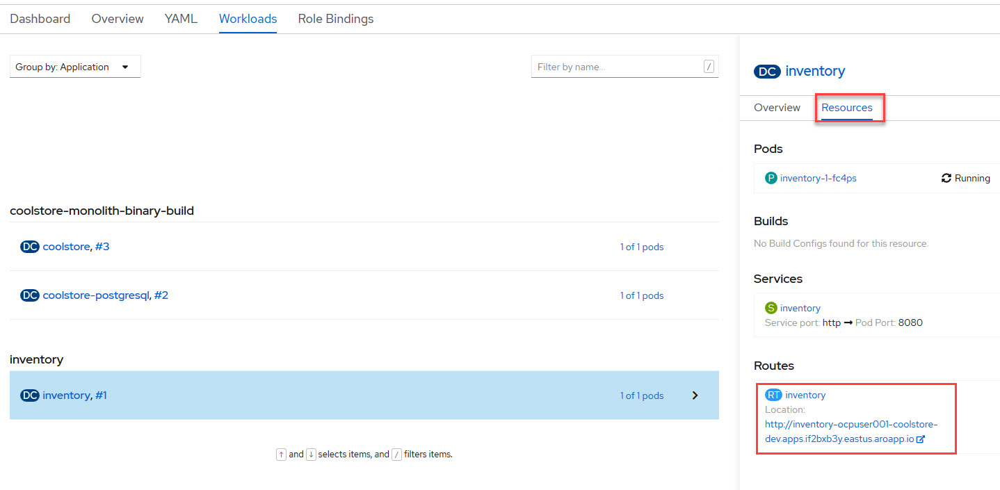

# SCENARIO 3: Transforming an existing monolith (Part 1)

* Purpose: Showing developers and architects how Red Hat jumpstarts modernization
* Difficulty: `intermediate`
* Time: `45 minutes`

## Intro
In the previous scenarios you learned how to take an existing monolithic Java EE application to the cloud with JBoss EAP and OpenShift, and you got a glimpse into the power of OpenShift for existing applications.

You will now begin the process of modernizing the application by breaking the application into multiple microservices using different technologies, with the eventual goal of re-architecting the entire application as a set of distributed microservices. Later on we'll explore how you can better manage and monitor the application after it is re-architected.

In this lab you will learn more about _Supersonic, Subatomic Java_ with [Quarkus](https://quarkus.io/), which is designed to be container and developer friendly.

Quarkus is a Kubernetes Native Java stack, crafted from the best of breed Java libraries and standards. Amazingly fast boot time, incredibly low RSS memory (not just heap size!) offering near instant scale up and high density memory utilization in container orchestration platforms like Kubernetes. Quarkus uses a technique called compile time boot.

Red Hat offers the fully supported Red Hat [Build of Quarkus](https://access.redhat.com/products/quarkus) (RHBQ) with support and maintenance of Quarkus. In this workhop, you will use Quarkus to develop Kubernetes-native microservices and deploy them to OpenShift. Quarkus is one of the runtimes included in [Red Hat Runtimes](https://www.redhat.com/en/products/runtimes).

## Goals of this scenario

The goal is to deploy this new microservice alongside the existing monolith, and then later on we'll tie them together. But after this scenario, you should end up with something like:

<kbd></kbd>

## What is Quarkus

Quarkus is a full-stack, Kubernetes-native Java framework made for Java virtual machines (JVMs) and native compilation, optimizing Java specifically for containers and enabling it to become an effective platform for serverless, cloud, and Kubernetes environments.

Quarkus is designed to work with popular Java standards, frameworks, and libraries like Eclipse MicroProfile, Apache Kafka, RESTEasy (JAX-RS), Hibernate ORM (JPA), Spring, Infinispan, Camel, and many more.

Quarkus’ dependency injection solution is based on CDI (contexts and dependency injection) and includes an extension framework to expand functionality and to configure, boot, and integrate a framework into your application. Adding an extension is as easy as adding a dependency, or you can use Quarkus tooling.

It also provides the correct information to GraalVM (a universal virtual machine for running apps written in a number of languages, including Java and JavaScript) for native compilation of your application.

## Setup for Exercise

To start in the right directory, from the CodeReady Workspaces Terminal, run the following command:
```
cd /projects/modernize-apps/inventory
```

## Examine the sample project

The sample project shows the components of a basic Quarkus project laid out in different subdirectories.

**1. Examine the Maven project structure.**

This is an empty Quarkus project with support for JAX-RS for building RESTful services. It has a single `pom.xml` file to use when building the project. It has several empty directories in which you will create the necessary classes. In the end we'll use several technologies to accomplish our goal:

* RESTEasy to expose the REST endpoints
* Hibernate ORM with Panache to perform CRUD operations on the database
* A PostgreSQL database running on Microsoft Azure

First, run the Maven build to make sure the skeleton project builds successfully. You should get a **BUILD SUCCESS** message in the logs, otherwise the build has failed.

> Make sure to run the **package** Maven goal and not **install**. The latter would download a lot more dependencies and do things you don't need yet!

~~~sh
mvn clean package
~~~~

You should see a **BUILD SUCCESS** in the logs.

We will add Quarkus extensions to the Inventory application for using _Panache_ (a simplified way to access data via Hibernate ORM), a database with Postgres (in production) and _H2_ (in-memory database for testing). We'll also add the ability to add health probes (which we'll use later on) using the MicroProfile Health extension. Run the following commands to add the extensions using CodeReady Terminal:

~~~sh
mvn -q quarkus:add-extension -Dextensions="hibernate-orm-panache, jdbc-postgresql, jdbc-h2"
~~~

you will see:

~~~
✅ Extension io.quarkus:quarkus-hibernate-orm-panache has been installed
✅ Extension io.quarkus:quarkus-jdbc-postgresql has been installed
✅ Extension io.quarkus:quarkus-jdbc-h2 has been installed
~~~

This adds the extensions to the `pom.xml`.

There are many [more extensions](https://quarkus.io/extensions/) for Quarkus for popular frameworks like [Vert.x](https://vertx.io/), [Apache Camel](http://camel.apache.org/), [Infinispan](http://infinispan.org/), Spring (e.g. `@Autowired`), and more.

Now let's write some code and create a domain model, service interface and a RESTful endpoint to access inventory.

## Create Inventory Domain

With our skeleton project in place, let's get to work defining the business logic.

The first step is to define the model (definition) of an Inventory object.

Using the CodeReady Workspaces File Explorer interface, create a new file named `Inventory.java` in directory `modernize-apps/inventory/src/main/java/com/redhat/coolstore/model` for the Inventory Java class in package `com.redhat.coolstore.model` with the following code:

~~~java
package com.redhat.coolstore;

import javax.persistence.Cacheable;
import javax.persistence.Entity;

import io.quarkus.hibernate.orm.panache.PanacheEntity;

@Entity
@Cacheable
public class Inventory extends PanacheEntity {

    public String itemId;
    public String location;
    public int quantity;
    public String link;

    public Inventory() {

    }
}
~~~

_Hibernate ORM_ is the de facto JPA implementation and offers you the full breadth of an Object Relational Mapper. It makes complex mappings possible, but it does not make simple and common mappings trivial. Hibernate ORM **with Quarkus Panache** focuses on making your entities trivial and fun to write in Quarkus.

By extending `PanacheEntity` in your entities, you will get an ID field that is auto-generated. If you require a custom ID
strategy, you can extend `PanacheEntityBase` instead and handle the ID yourself.

By using Use public fields, there is no need for functionless getters and setters (those that simply get or set the field). You
simply refer to fields like Inventory.location without the need to write a Inventory.getLocation() implementation. Panache will
auto-generate any getters and setters you do not write, or you can develop your own getters/setters that do more than get/set,
which will be called when the field is accessed directly.

The `PanacheEntity` superclass comes with lots of super useful static methods and you can add your own in your derived entity
class. Much like traditional object-oriented programming it’s natural and recommended to place custom queries as close to the
entity as possible, ideally within the entity definition itself. Users can just start using your entity Inventory by typing
Inventory, and get completion for all the operations in a single place.

When an entity is annotated with `@Cacheable`, all its field values are cached except for collections and relations to other
entities. This means the entity can be loaded quicker without querying the database for frequently-accessed, but rarely-changing
data.

## Configure Azure PostgreSQL Database

For local testing we'll use an in-memory database, but for production we'll use an Azure PostgreSQL database.

Open the empty `modernize-apps/inventory/src/main/resources/application.properties` file. This file contains Quarkus application configuration. Add the following values:

~~~properties
%dev.quarkus.datasource.url=jdbc:h2:mem:inventory
%dev.quarkus.datasource.driver=org.h2.Driver
%dev.quarkus.datasource.username=inventory
%dev.quarkus.datasource.password=mysecretpassword
%dev.quarkus.datasource.max-size=8
%dev.quarkus.datasource.min-size=2
%dev.quarkus.hibernate-orm.database.generation=drop-and-create
%dev.quarkus.hibernate-orm.log.sql=false

%prod.quarkus.datasource.driver = org.postgresql.Driver
%prod.quarkus.hibernate-orm.database.generation=drop-and-create
%prod.quarkus.hibernate-orm.sql-load-script=import.sql

#
# !! Update these with your assigned Azure PostgreSQL hostname and username
#
%prod.quarkus.datasource.url = jdbc:postgresql://{Azure PostgreSQL Host Name}:5432/{ocpuser0XX}?ssl=true&sslmode=require
%prod.quarkus.datasource.username ={PostgreSQL Username}@{Azure PostgreSQL Host Name}
%prod.quarkus.datasource.password = {PostgreSQL Password}
~~~

After adding the above lines, update the last few with your `Azure PostgreSQL Host Name`, `Your User ID (ocpuser0XX)`, `PostgreSQL Username` and `PostgreSQL Password` as assigned to you for this lab.

> **WARNING**: Make sure to remove the surrounding brace characters! So your final value for `prod.quarkus.datasource.url` would be something like `jdbc:postgresql://coolstore.postgres.database.azure.com:5432/ocpuser099?ssl=true&sslmode=require` and the value for `prod.quarkus.datasource.username` would look like `ocpuser099@coolstore.postgres.database.azure.com`

The prefixes like `%dev` are naming specific Quarkus _configuration profiles_. These allows you to have multiple configurations in the same file and select between then via a _profile name_,
such as `%dev` (when running locally as a developer) or `%prod` (production).

By default Quarkus has three profiles, although it is possible to use as many as you like. The default profiles are:

* `dev` - Activated when in development mode (i.e. *quarkus:dev*)
* `test` - Activated when running tests
* `prod` - The default profile when not running in development or test mode

## Add inventory test data

Let’s add inventory data to the database so we can test things out. Create a new file at the path `modernize-apps/inventory/src/main/resources/import.sql` file and copy
the following SQL statements to *import.sql*:

~~~sql
INSERT INTO INVENTORY (id, itemId, link, location, quantity) values (nextval('hibernate_sequence'), '329299', 'http://maps.google.com/?q=Raleigh', 'Raleigh', 736);
INSERT INTO INVENTORY (id, itemId, link, location, quantity) values (nextval('hibernate_sequence'), '329199', 'http://maps.google.com/?q=Boston', 'Boston', 512);
INSERT INTO INVENTORY (id, itemId, link, location, quantity) values (nextval('hibernate_sequence'), '165613', 'http://maps.google.com/?q=Seoul', 'Seoul', 256);
INSERT INTO INVENTORY (id, itemId, link, location, quantity) values (nextval('hibernate_sequence'), '165614', 'http://maps.google.com/?q=Singapore', 'Singapore', 54);
INSERT INTO INVENTORY (id, itemId, link, location, quantity) values (nextval('hibernate_sequence'), '165954', 'http://maps.google.com/?q=London', 'London', 87);
INSERT INTO INVENTORY (id, itemId, link, location, quantity) values (nextval('hibernate_sequence'), '444434', 'http://maps.google.com/?q=NewYork', 'NewYork', 443);
INSERT INTO INVENTORY (id, itemId, link, location, quantity) values (nextval('hibernate_sequence'), '444435', 'http://maps.google.com/?q=Paris', 'Paris', 600);
INSERT INTO INVENTORY (id, itemId, link, location, quantity) values (nextval('hibernate_sequence'), '444437', 'http://maps.google.com/?q=Tokyo', 'Tokyo', 230);
~~~

Build and package the Inventory service using Maven to make sure your code compiles:

~~~sh
mvn clean package
~~~~

If it builds successfully, continue to the next step to create a new service.

## Create Inventory RESTful Service

In this step we will mirror the abstraction of a service so that we can inject the Inventory service into various places (like a RESTful resource endpoint) in the future. This is the same approach that our monolith uses, so we can re-use this idea again. Create a new file named `InventoryResource.java` in directory `modernize-apps/inventory/src/main/java/com/redhat/coolstore` for the InventoryResource Java class in package `com.redhat.coolstore` with the code below:

~~~java
package com.redhat.coolstore;

import java.util.List;
import java.util.stream.Collectors;

import javax.enterprise.context.ApplicationScoped;
import javax.json.Json;
import javax.ws.rs.Consumes;
import javax.ws.rs.GET;
import javax.ws.rs.Path;
import javax.ws.rs.Produces;
import javax.ws.rs.WebApplicationException;
import javax.ws.rs.core.Response;
import javax.ws.rs.core.MediaType;
import javax.ws.rs.ext.ExceptionMapper;
import javax.ws.rs.ext.Provider;

import org.jboss.resteasy.annotations.jaxrs.PathParam;

@Path("/services/inventory")
@ApplicationScoped
@Produces(MediaType.APPLICATION_JSON)
@Consumes(MediaType.APPLICATION_JSON)
public class InventoryResource {

    @GET
    public List<Inventory> getAll() {
        return Inventory.listAll();
    }

    @GET
    @Path("/{itemId}")
    public List<Inventory> getAvailability(@PathParam String itemId) {
        return Inventory.<Inventory>streamAll()
        .filter(p -> p.itemId.equals(itemId))
        .collect(Collectors.toList());
    }

    @Provider
    public static class ErrorMapper implements ExceptionMapper<Exception> {

        @Override
        public Response toResponse(Exception exception) {
            int code = 500;
            if (exception instanceof WebApplicationException) {
                code = ((WebApplicationException) exception).getResponse().getStatus();
            }
            return Response.status(code)
                    .entity(Json.createObjectBuilder().add("error", exception.getMessage()).add("code", code).build())
                    .build();
        }

    }
}
~~~

The above REST services defines two endpoints:

* `/services/inventory` that is accessible via _HTTP GET_ which will return all known product Inventory entities as JSON
* `/services/inventory/<itemId>` that is accessible via _HTTP GET_ at for example `services/inventory/329199` with the last path parameter
being the ID for which we want inventory status.

Re-Build and package the Inventory service using Maven to make sure your code compiles:

~~~sh
mvn clean package
~~~~

You should see a **BUILD SUCCESS** in the build logs. If builds successfully, continue to the next step to create a new RESTful endpoint that uses this service.

## Test Locally

Using the Quarkus maven plugin (predefined in pom.xml), you can conveniently run the application locally and test the endpoint by entering the following command in the CodeReady Workspaces Terminal window:
~~~sh
mvn quarkus:dev
~~~

> As an uber-jar, it could also be run with `java -jar target/inventory-1.0.0-runner.jar` but you don't need to do this now

Once the application is done initializing you should see:

You should see a bunch of log output that ends with:

~~~console
2020-03-19 14:41:17,171 INFO  [io.agr.pool] (main) Datasource '<default>': Initial size smaller than min. Connections will be created when necessary
2020-03-19 14:41:17,454 INFO  [io.quarkus] (main) inventory 1.0-SNAPSHOT (running on Quarkus xx.xx.xx) started in 3.353s. Listening on: http://0.0.0.0:8080
2020-03-19 14:41:17,457 INFO  [io.quarkus] (main) Profile dev activated. Live Coding activated.
2020-03-19 14:41:17,457 INFO  [io.quarkus] (main) Installed features: [agroal, cdi, hibernate-orm, hibernate-orm-panache, jdbc-h2, narayana-jta, resteasy, resteasy-jsonb, smallrye-health]
~~~
Running locally using `quarkus:dev` will use the local database.

**3. Test the application**

Once you run the application a pop will appear. Click on the Open Link button in that pop-up to open the application.

<kbd></kbd>

Or open a second CodeReady Workspaces Terminal window (if a second one is not already open) by clicking on New terminal button, Navigate to it and run the below command to see the html code deployed.

```
curl http://localhost:8080
```

This is a simple webpage that will access the inventory *every 2 seconds* and refresh the table of product inventories.

To see the raw JSON output using `curl`, open a new terminal and run the test:

`curl http://localhost:8080/services/inventory/329299 ; echo`

You would see a JSON response like this:

~~~json
{"itemId":"329299","location":"Raleigh","quantity":736,"link":"http://maps.google.com/?q=Raleigh"}
~~~

The REST API returned a JSON object representing the inventory count for this product. Congratulations!

**4. Stop the application**

Before moving on, click in the first terminal window where Quarkus is running and then press `CTRL-C` to stop the running application.

You should see something like:

~~~sh
INFO  [io.quarkus] (Quarkus Shutdown Thread) Quarkus stopped in 0.007s
~~~

This indicates the application is stopped.

## Congratulations

You have now successfully created your first microservice using Quarkus and implemented a basic RESTful API on top of the database. Most of the code is the same as was found in the monolith, demonstrating how easy it is to migrate existing monolithic Java EE applications to microservices using Quarkus.

In next steps of this scenario we will deploy our application to OpenShift Container Platform and then start adding additional features to take care of various aspects of cloud native microservice development.


## Navigate to OpenShift dev Project

We have already deployed our coolstore monolith to OpenShift, but now we are working on re-architecting it to be microservices-based.

In this step we will deploy our new Inventory microservice for our CoolStore application, so let's navigate back to `ocpuser0XX-coolstore-dev`

From the CodeReady Workspaces Terminal window, navigate back to `ocpuser0XX-coolstore-dev` project by entering the following command:
```
oc project ocpuser0XX-coolstore-dev
```

## Deploy to OpenShift

Let's deploy our new inventory microservice to OpenShift!

**1. Build and Deploy**

In this step, we will deploy our new Inventory microservice for our CoolStore application.

First we will repackage the Quarkus application for adding a PostgreSQL extension because our
Inventory service will connect to Azure PostgeSQL database in production on OpenShift.

Quarkus also offers the ability to automatically generate OpenShift resources based on sane default and user supplied configuration. The OpenShift extension is actually a wrapper extension that brings together the [kubernetes](https://quarkus.io/guides/deploying-to-kubernetes) and [container-image-s2i](https://quarkus.io/guides/container-image#s2i) extensions with defaults so that it’s easier for the user to get started with Quarkus on OpenShift.

Add the OpenShift extension via the Terminal:

~~~sh
mvn -q quarkus:add-extension -Dextensions="openshift"
~~~

you will see:

~~~
✅ Extension io.quarkus:quarkus-openshift has been installed
~~~

Next, add the following lines to your _modernize-apps/inventory/src/main/resources/application.properties_:

~~~properties
%prod.quarkus.s2i.base-jvm-image=registry.access.redhat.com/ubi8/openjdk-11
%prod.quarkus.kubernetes-client.trust-certs=true
%prod.quarkus.container-image.build=true
%prod.quarkus.kubernetes.deploy=true
%prod.quarkus.kubernetes.deployment-target=openshift
%prod.quarkus.openshift.expose=true
%prod.quarkus.openshift.labels.app.openshift.io/runtime=quarkus
~~~

This configures the Kubernetes and Quarkus extensions on how to build and deploy the application after it is built. Quarkus will create the necessary resource objects (typically written in yaml), and automatically add them to our namespace to cause the app to be built and deployed.

With this defined, invoke the following command to build _and_ deploy the app to OpenShift:

~~~sh
mvn clean package
~~~~

This will take a bit longer to build the Quarkus app, build and push the container image, and then deploy to OpenShift.

After the build finishes it will take less than a minute for the application to become available. To verify that everything is started, run the following command and wait for it complete successfully:

~~~sh
oc rollout status -w dc/inventory
~~~

**3. Access the application running on OpenShift**

This sample project includes a simple UI that allows you to access the Inventory API. This is the same
UI that you previously accessed outside of OpenShift which shows the CoolStore inventory. Navigate through **Home > Projects > ocpuser0XX-coolstor-dev > Workloads**. Open inventory workload, click on resources and open the route URL to see inventory webpage.

<kbd></kbd>

The inventory webpage will look like this :

<kbd></kbd>

> **NOTE**: If you get a '404 Not Found' error, just reload the page a few times until the Inventory UI appears. This
is due to a lack of health check which you are about to fix!

The UI will refresh the inventory table every 2 seconds, as before.

In the next steps you will enhance OpenShift's ability to manage the application lifecycle by implementing a _health check pattern_. By default, without health checks (or health _probes_) OpenShift considers services to be ready to accept service requests even before the application is truly ready or if the application is hung or otherwise unable to service requests. OpenShift must be _taught_ how to recognize that our app is alive and ready to accept requests.

## Add Health Check Extension
### What is a Health Check?

A key requirement in any managed application container environment is the ability to determine when the application is in a ready state. Only when an application has reported as ready can the manager (in this case OpenShift) act on the next step of the deployment process. OpenShift makes use of various _probes_ to determine the health of an application during its lifespan. A _readiness_ probe is one of these mechanisms for validating application health and determines when an application has reached a point where it can begin to accept incoming traffic. At that point, the IP address for the pod is added to the list of endpoints backing the service and it can begin to receive requests. Otherwise traffic destined for the application could reach the application before it was fully operational resulting in error from the client perspective.

Once an application is running, there are no guarantees that it will continue to operate with full functionality. Numerous factors including out of memory errors or a hanging process can cause the application to enter an invalid state. While a _readiness_ probe is only responsible for determining whether an application is in a state where it should begin to receive incoming traffic, a _liveness_ probe is used to determine whether an application is still in an acceptable state. If the liveness probe fails, OpenShift will destroy the pod and replace it with a new one.

In our case we will implement the health check logic in a REST endpoint and let Quarkus publish that logic on the `/health` endpoint for use with OpenShift.

**Add `quarkus-smallrye-health` extension**

Add the Quarkus Health Probe extension for Kubernetes via the Terminal:

~~~sh
mvn -q quarkus:add-extension -Dextensions="quarkus-smallrye-health"
~~~

you will see:

~~~
✅ Extension io.quarkus:quarkus-smallrye-health has been installed
~~~

## Define Health Check Endpoint

We are now ready to define the logic of our health check endpoint.

**1. Create empty Java class**

The logic will be put into a new Java class. Create a file `modernize-apps/Inventory/src/main/java/com/redhat/coolstore/InventoryHealthCheck.java`

**2. Add logic**

Next, let's fill in the class by creating a new RESTful endpoint which will be used by OpenShift to probe our services.
Copy the code fragment below into the newly created file to implement the logic.

~~~java
package com.redhat.coolstore;

import javax.enterprise.context.ApplicationScoped;
import javax.inject.Inject;

import org.eclipse.microprofile.health.HealthCheck;
import org.eclipse.microprofile.health.HealthCheckResponse;
import org.eclipse.microprofile.health.Readiness;

@Readiness
@ApplicationScoped
public class InventoryHealthCheck implements HealthCheck {

    @Inject
    private InventoryResource inventoryResource;

    @Override
    public HealthCheckResponse call() {

        if (inventoryResource.getAll() != null) {
            return HealthCheckResponse.named("Success of Inventory Health Check!!!").up().build();
        } else {
            return HealthCheckResponse.named("Failure of Inventory Health Check!!!").down().build();
        }
    }
}
~~~

The `call()` method exposes an HTTP GET endpoint which will return the status of the service. The logic of this check does a
simple query to the underlying database to ensure the connection to it is stable and available. The method is also annotated with
MicroProfile's `@Readiness` annotation, which directs Quarkus to expose this endpoint as a health check at `/health/ready`.

As you can see health check procedures are defined as implementations of the HealthCheck interface which are defined as CDI beans with the one of the following CDI qualifiers:

`@Liveness` - the liveness check accessible at /health/live

`@Readiness` - the readiness check accessible at /health/ready

HealthCheck is a functional interface whose single method call returns a HealthCheckResponse object which can be easily constructed by the fluent builder API shown in the example.

Build and deploy the Inventory service again using Maven:

~~~sh
mvn clean package
~~~~

You should see a **BUILD SUCCESS** in the build logs, and the application will be re-deployed to OpenShift with its new health checks in place.

To verify that everything is started, run the following command and wait for it report `replication controller "inventory-xxxx" successfully rolled out`

~~~sh
oc rollout status -w dc/inventory
~~~

Once the project is deployed, you should be able to access the health check logic at the `/health` endpoint using a simple _curl_ command. This is the same API that OpenShift will repeatedly poll to determine application health. Run:

~~~sh
curl $(oc get route inventory -o jsonpath="{.spec.host}")/health
~~~

You should see a JSON response like:

~~~json
{
  "status": "UP",
  "checks": [
    {
      "name": "Success of Inventory Health Check!!!",
      "status": "UP"
    },
    {
      "name": "Database connections health check",
      "status": "UP"
    }
  ]
}
~~~

> You can define separate readiness and liveness probes using `@Liveness` and `@Readiness` annotations and access them separately at `/health/live` and `/health/ready`.

The general _outcome_ of the health check is computed as a logical AND of all the declared health check procedures. Quarkus extensions can also provide default health checks out of the box, which is why you see the `Database connections health check` above, since we are using a database extension.

**2. Adjust probe timeout**

The various timeout values for the probes can be configured in many ways. Let's tune the _liveness probe_ initial delay so that we don't have to wait 3 minutes for it to be activated. Use the **oc** command to tune the probe to wait 30 seconds before starting to poll the probe:

`oc set probe dc/inventory --liveness --initial-delay-seconds=30`

Next, run the `oc describe` command below and look at the `delay=` value for the Liveness probe:

`oc describe dc/inventory | egrep 'Readiness|Liveness'`

~~~sh
    Liveness:   http-get http://:8080/health/live delay=30s timeout=10s period=30s #success=1 #failure=3
    Readiness:  http-get http://:8080/health/ready delay=0s timeout=10s period=30s #success=1 #failure=3
~~~

In the next step we'll exercise the probe and watch as it fails and OpenShift recovers the application.

## Exercise Health Check

From the OpenShift Web Console overview page, click on the route link to open the sample application UI:

<kbd></kbd>

This will open up the sample application UI in a new browser tab:

<kbd></kbd>

The app will begin polling the inventory as before and report success:

<kbd></kbd>

Now you will corrupt the service and cause its health check to start failing.
To simulate the app crashing, let's kill the underlying service so it stops responding. Execute:

`oc rsh dc/inventory kill 1`

This will execute the Linux `kill` command to stop the running Java process in the container.

Check out the application sample UI page and notice it is now failing to access the inventory data, and the
`Last Successful Fetch` counter starts increasing, indicating that the UI cannot access inventory. This could have
been caused by an overloaded server, a bug in the code, or any other reason that could make the application
unhealthy.

<kbd></kbd>

At this point, return to the OpenShift web console, navigate through **Projects > ocpuser0XX-coolstore-dev > Workloads** and then click on **Inventory** workload to see the blue circles failing.

After too many liveness probe failures, OpenShift will forcibly kill the pod and container running the service, and spin up a new one to take its place. Once this occurs, the light blue circle should return to dark blue. This should take about 30 seconds.

Return to the same sample app UI (without reloading the page) and notice that the UI has automatically re-connected to the new service and successfully accessed the inventory once again:

<kbd></kbd>


## Summary

In this scenario you learned a bit more about what Quarkus is, and how it can be used to create modern Java microservice-oriented applications.

You created a new Inventory microservice representing functionality previously implmented in the monolithic CoolStore application. For now this new microservice is completely disconnected from our monolith and is not very useful on its own. In future steps you will link this and other microservices into the monolith to begin the process of [strangling the monolith](https://www.martinfowler.com/bliki/StranglerApplication.html).

Quarkus brings in a number of concepts and APIs from the Java EE community, so your existing Java EE skills can be re-used to bring your applications into the modern world of containers, microservices and cloud deployments.

Quarkus is one of many components of Red Hat Runtimes. In the next scenario you'll use Spring Boot, another popular framework, to implement additional microservices. Let's go!
