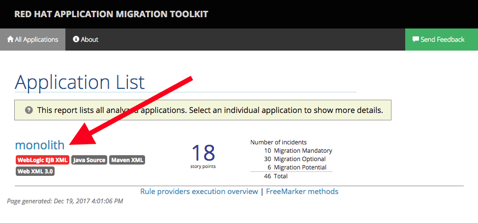
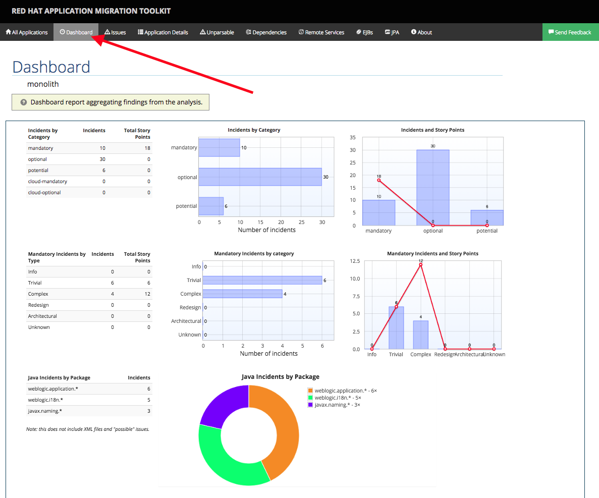
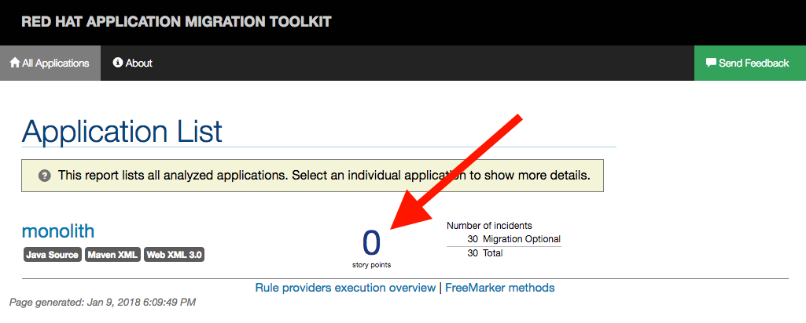
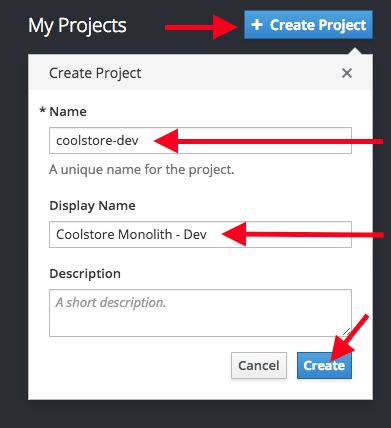
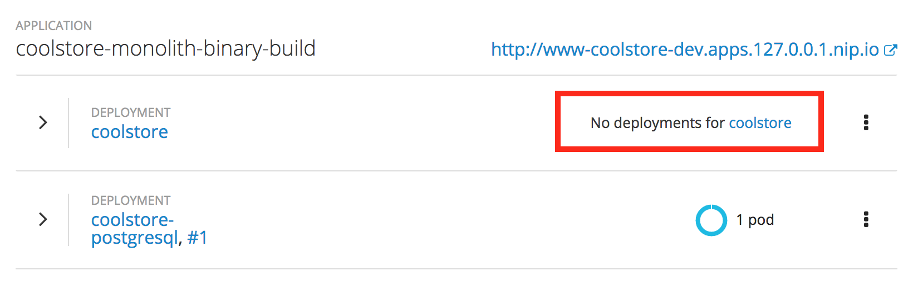
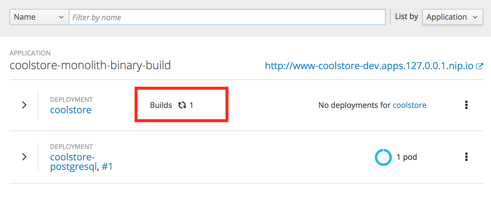

# SCENARIO 1: Moving existing apps to the cloud

* Purpose: 
* Difficulty: `intermediate`
* Time: `45 minutes`

## Intro
In this scenario you will see how easy it is to migrate from legacy platforms to JBoss EAP.
We'll answer questions like:

* Why move applications to OCP and cloud?
* What does the lift and shift process look like?

We will then take the following steps to migrate (lift & shift) an existing Java EE app to EAP+OpenShift using [Red Hat Application Migration Toolkit](https://developers.redhat.com/products/rhamt/overview/) (RHAMT)

* Analyze existing WebLogic monolith application using RHAMT.
* Review the report and update code and config to run on JBoss EAP
* Deploy to OpenShift
* Use OpenShift features like automatic clustering and failover to enhance the application

## What is Red Hat Application Migration Toolkit?

<kbd></kbd>

Red Hat Application Migration Toolkit (RHAMT) is an extensible and customizable rule-based tool that helps simplify migration of Java applications.

It is used by organizations for:

* Planning and work estimation
* Identifying migration issues and providing solutions
* Detailed reporting
* Using built-in rules and migration paths
* Rule extension and customizability
* Ability to analyze source code or application archives

RHAMT examines application artifacts, including project source directories and application archives, then produces an HTML report that highlights areas needing changes. RHAMT can be used to migrate Java applications from previous versions of Red Hat JBoss Enterprise Application Platform or from other containers, such as Oracle® WebLogic Server or IBM® WebSphere® Application Server.

## How Does Red Hat Application Migration Toolkit Simplify Migration?

Red Hat Application Migration Toolkit looks for common resources and highlights technologies and known trouble spots when migrating applications. The goal is to provide a high-level view into the technologies used by the application and provide a detailed report organizations can use to estimate, document, and migrate enterprise applications to Java EE and Red Hat JBoss Enterprise Application Platform.

> RHAMT is usually part of a much larger application migration and modernization program that involves well defined and repeatable phases over weeks or months and involves many people from a given business. Do not be fooled into thinking that every single
migration is a simple affair and takes an hour or less! To learn more about Red Hat's philosophy and proven methodology, check out
the [RHAMT documentation](https://access.redhat.com/documentation/en/red-hat-application-migration-toolkit) and contact your local Red Hat representative when embarking on a real world migration and modernization strategy.

## More RHAMT Resources

* [Documentation](https://access.redhat.com/documentation/en/red-hat-application-migration-toolkit)
* [Developer Homepage](https://developers.redhat.com/products/rhamt/overview/)


## Setup for Exercise
To start in the right directory, from the CodeReady Workspaces Terminal window, run the following commands to set up your environment for this scenario:

~~~shell
cd /projects/modernize-apps/monolith
~~~

## Analyzing a Java EE app using Red Hat Application Migration Toolkit

In this step we will analyze an existing application built for use with
Oracle® WebLogic Server (WLS). This application is a Java EE application
using a number of different technologies, including standard Java EE APIs
as well as proprietary Weblogic APIs and best practices.

The Red Hat Application Migration Toolkit can be installed and used in a few different ways:

* **Web Console** - The web console for Red Hat Application Migration Toolkit is a web-based system that allows a team of users to assess and prioritize migration and modernization efforts for a large number of applications. It allows you to group applications into projects for analysis and provides numerous reports that highlight the results.
* **Command Line Interface** - The CLI is a command-line tool that allows users to assess and prioritize migration and modernization efforts for applications. It provides numerous reports that highlight the analysis results.
* **Eclipse Plugin** - The Eclipse plugin for Red Hat Application Migration Toolkit provides assistance directly in Eclipse and Red Hat JBoss Developer Studio for developers making changes for a migration or modernization effort. It analyzes your projects using RHAMT, marks migration issues in the source code, provides guidance to fix the issues, and offers automatic code replacement when possible.

For this scenario, we will use the CLI as you are the only one that will run RHAMT in this system. For multi-user use, the Web Console would be a good option.

**1. Verify Red Hat Application Migration Toolkit CLI**

The RHAMT CLI is has been installed for you. To verify that the tool was properly installed, run:

``${HOME}/rhamt-cli-4.0.0.Beta4/bin/rhamt-cli --version``

You should see:

~~~shell
Using RHAMT at /home/jboss/rhamt-cli-4.0.0.Beta4
> Red Hat Application Migration Toolkit (RHAMT) CLI, version 4.0.0.Beta4.
~~~

**2. Inspect the project source code**

The sample project we will migrate is a monolithic Java EE application that implements
an online shopping store called _Coolstore_ containing retail items that you can add to a shopping
cart and purchase. The source code is laid out in different
subdirectories according to Maven best practices.

``tree -L 3``

You should see:

~~~shell
.
+-- hello.txt
+-- pom.xml
+-- README.md
\-- src
    \-- main
        +-- java
        +-- openshift
        +-- resources
        \-- webapp
~~~

This is a minimal Java EE project which uses [JAX-RS](https://docs.oracle.com/javaee/7/tutorial/jaxrs.htm) for building
RESTful services and the [Java Persistence API (JPA)](https://docs.oracle.com/javaee/7/tutorial/partpersist.htm) for connecting
to a database and an [AngularJS](https://angularjs.org) frontend.

When you later deploy the application, it will look like:

<kbd></kbd>

**3. Run the RHAMT CLI against the project**

The RHAMT CLI has a number of options to control how it runs. Run the below command
to execute the RHAMT CLI and analyze the existing project:

~~~shell
  ${HOME}/rhamt-cli-4.0.0.Beta4/bin/rhamt-cli \
  --sourceMode \
  --input /projects/modernize-apps/monolith \
  --output /projects/rhamt-reports/monolith \
  --overwrite \
  --source weblogic \
  --target eap:7 \
  --packages com.redhat weblogic

~~~

> Note the use of the ``--source`` and ``--target`` options. This allows you to target specific migration paths supported by RHMAT. Other
migration paths include **IBM® WebSphere® Application Server** and **JBoss EAP** 5/6/7.

**Wait for it to complete before continuing!**. You should see `Report created: /projects/rhamt-reports/monolith/index.html`.

**3. View the results**

Next, go to the **project explorer > expand rhamt-report** on the left hand side. Right click on **index.html** and click on **preview** to view the landing page.

You should see the landing page for the report:

<kbd></kbd>

The main landing page of the report lists the applications that were processed. Each row contains a high-level overview of the story points, number of incidents, and technologies encountered in that application.

Click on the `monolith` link to access details for the project:

<kbd></kbd>

## Understanding the report

The Dashboard gives an overview of the entire application migration effort. It summarizes:

* The **incidents and story points by category**
* The **incidents and story points by level of effort** of the suggested changes
* The **incidents by package**

> Story points are an abstract metric commonly used in Agile software development to estimate the relative level of effort needed to implement a feature or change.
Red Hat Application Migration Toolkit uses story points to express the level of effort needed to migrate particular application constructs, and the application as a whole.
The level of effort will vary greatly depending on the size and complexity of the application(s) to migrate.

There are several other sub-pages accessible by the menu near the top. Click on each one and observe the results for each of these pages:

* **All Applications** Provides a list of all applications scanned.
* **Dashboard** Provides an overview for a specific application.
* **Issues** Provides a concise summary of all issues that require attention.
* **Application Details** provides a detailed overview of all resources found within the application that may need attention during the migration.
* **Unparsable** shows all files that RHAMT could not parse in the expected format. For instance, a file with a .xml or .wsdl suffix is assumed to be an XML file. If the XML parser fails, the issue is reported here and also where the individual file is listed.
* **Dependencies** displays all Java-packaged dependencies found within the application.
* **Remote Services** Displays all remote services references that were found within the application.
* **EJBs** contains a list of EJBs found within the application.
* **JBPM** contains all of the JBPM-related resources that were discovered during analysis.
* **JPA** contains details on all JPA-related resources that were found in the application.
* **About** Describes the current version of RHAMT and provides helpful links for further assistance.

> Some of the above sections may not appear depending on what was detected in the project.

Now that you have the RHAMT report available, let's get to work migrating the app!

## Set Maven environment variables

In order to use Maven we have to set up the following environment variable. Run the below command on the codeready workspace terminal before moving on.
```
export MAVEN_OPTS='-Xmx2048m -XX:MaxPermSize=2048m'
```

## Migrate Application Startup Code

In this step we will migrate some Weblogic-specific code in the app to use standard Java EE interfaces.

**1. Review the issue related to `ApplicationLifecycleListener`**

Open the Issues report

<kbd></kbd>

RHAMT provides helpful links to understand the issue deeper and offer guidance for the migration.

The WebLogic `ApplicationLifecycleListener` abstract class is used to perform functions or schedule jobs at Oracle WebLogic Server start and stop. In this case we have
code in the `postStart` and `preStop` methods which are executed after Weblogic starts up and before it shuts down, respectively.

In JBoss Enterprise Application Platform, there is no equivalent to intercept these events, but you can get equivalent functionality using a _Singleton EJB_ with standard annotations,
as suggested in the issue in the RHAMT report.

We will use the `@Startup` annotation to tell the container to initialize the singleton session
bean at application start. We will similarly use the `@PostConstruct` and `@PreDestroy` annotations to specify the
methods to invoke at the start and end of the application lifecyle achieving the same result but without
using proprietary interfaces.

While the code in our startup and shutdown is very simple, in the real world this code may require additional thought as part of the migration. However,
using this method makes the code much more portable.

**2. Open the file**

Navigate to your CodeReady Workspace File Explorer and expand the "modernize-apps" directory to the following file:
`modernize-apps/monolith/src/main/java/com/redhat/coolstore/utils/StartupListener.java`.Double click on the StartupListener.java" file to open it

The first issue we will tackle is the one reporting the use of _Weblogic ApplicationLifecyleEvent_ and
_Weblogic LifecycleListener_ in this file. Open the file to make these changes in the file.


~~~java
package com.redhat.coolstore.utils;

import javax.annotation.PostConstruct;
import javax.annotation.PreDestroy;
import javax.ejb.Startup;
import javax.inject.Singleton;
import javax.inject.Inject;
import java.util.logging.Logger;

@Singleton
@Startup
public class StartupListener {

    @Inject
    Logger log;

    @PostConstruct
    public void postStart() {
        log.info("AppListener(postStart)");
    }

    @PreDestroy
    public void preStop() {
        log.info("AppListener(preStop)");
    }

}
~~~

**3. Test the build**

From the CodeReady Workspaces Terminal window, build and package the app using Maven to make sure the changed code still compiles:
~~~shell
cd /projects/modernize-apps/monolith
mvn clean package
~~~

If builds successfully (you will see `BUILD SUCCESS`), then let's move on to the next issue! If it does not compile,
verify you made all the changes correctly and try the build again.

## Migrate Logging

In this step we will migrate some Weblogic-specific code in the app to use standard Java EE interfaces.

Some of our application makes use of Weblogic-specific logging methods, which offer features related to logging of
internationalized content, and client-server logging.

In this case we are using Weblogic's `NonCatalogLogger` which is a simplified logging framework that doesn't use
localized message catalogs (hence the term _NonCatalog_).

The WebLogic `NonCatalogLogger` is not supported on JBoss EAP (or any other Java EE platform), and should be migrated to a supported logging framework, such as the JDK Logger or JBoss Logging.

We will use the standard Java Logging framework, a much more portable framework. The framework also
[supports internationalization](https://docs.oracle.com/javase/8/docs/technotes/guides/logging/overview.html#a1.17) if needed.

**1. Open the file**

Navigate to your CodeReady Workspace File Explorer and expand the "modernize-apps" directory to the following file:
`modernize-apps/monolith/src/main/java/com/redhat/coolstore/service/OrderServiceMDB.java`


**2. Make the changes** Open the file to make these changes:

~~~java
package com.redhat.coolstore.service;

import javax.ejb.ActivationConfigProperty;
import javax.ejb.MessageDriven;
import javax.inject.Inject;
import javax.jms.JMSException;
import javax.jms.Message;
import javax.jms.MessageListener;
import javax.jms.TextMessage;

import com.redhat.coolstore.model.Order;
import com.redhat.coolstore.utils.Transformers;

import java.util.logging.Logger;

@MessageDriven(name = "OrderServiceMDB", activationConfig = {
	@ActivationConfigProperty(propertyName = "destinationLookup", propertyValue = "topic/orders"),
	@ActivationConfigProperty(propertyName = "destinationType", propertyValue = "javax.jms.Topic"),
	@ActivationConfigProperty(propertyName = "acknowledgeMode", propertyValue = "Auto-acknowledge")})
public class OrderServiceMDB implements MessageListener {

	@Inject
	OrderService orderService;

	@Inject
	CatalogService catalogService;

	private Logger log = Logger.getLogger(OrderServiceMDB.class.getName());

	@Override
	public void onMessage(Message rcvMessage) {
		TextMessage msg = null;
		try {
				if (rcvMessage instanceof TextMessage) {
						msg = (TextMessage) rcvMessage;
						String orderStr = msg.getBody(String.class);
						log.info("Received order: " + orderStr);
						Order order = Transformers.jsonToOrder(orderStr);
						log.info("Order object is " + order);
						orderService.save(order);
						order.getItemList().forEach(orderItem -> {
							catalogService.updateInventoryItems(orderItem.getProductId(), orderItem.getQuantity());
						});
				}
		} catch (JMSException e) {
			throw new RuntimeException(e);
		}
	}

}
~~~

That one was pretty easy.

## Test the build

Build and package the app using Maven to make sure you code still compiles:

`mvn clean package`

If builds successfully (you will see `BUILD SUCCESS`), then let's move on to the next issue! If it does not compile,
verify you made all the changes correctly and try the build again.


## Migrate JMS Topic

In this final step we will again migrate some Weblogic-specific code in the app to use standard Java EE interfaces,
and one JBoss-specific interface.

Our application uses [JMS](https://en.wikipedia.org/wiki/Java_Message_Service) to communicate. Each time an order is placed in the application, a JMS message is sent to
a JMS Topic, which is then consumed by listeners (subscribers) to that topic to process the order using [Message-driven beans](https://docs.oracle.com/javaee/6/tutorial/doc/gipko.html), a form
of Enterprise JavaBeans (EJBs) that allow Java EE applications to process messages asynchronously.

In this case, `InventoryNotificationMDB` is subscribed to and listening for messages from `ShoppingCartService`. When
an order comes through the `ShoppingCartService`, a message is placed on the JMS Topic. At that point, the `InventoryNotificationMDB`
receives a message and if the inventory service is below a pre-defined threshold, sends a message to the log indicating that
the supplier of the product needs to be notified.

Unfortunately this MDB was written a while ago and makes use of weblogic-proprietary interfaces to configure and operate the
MDB. RHAMT has flagged this and reported it using a number of issues.

JBoss EAP provides and even more efficient and declarative way
to configure and manage the lifecycle of MDBs. In this case, we can use annotations to provide the necessary initialization
and configuration logic and settings. We will use the
`@MessageDriven` and `@ActivationConfigProperty` annotations, along with the `MessageListener` interfaces to provide the
same functionality as from Weblogic.

Much of Weblogic's interfaces for EJB components like MDBs reside in Weblogic descriptor XML files. Open
``src/main/webapp/WEB-INF/weblogic-ejb-jar.xml`` to see one of these descriptors. There are many different configuration
possibilities for EJBs and MDBs in this file, but luckily our application only uses one of them, namely it configures
`<trans-timeout-seconds>` to 30, which means that if a given transaction within an MDB operation takes too
long to complete (over 30 seconds), then the transaction is rolled back and exceptions are thrown. This interface is
Weblogic-specific so we'll need to find an equivalent in JBoss.

> You should be aware that this type of migration is more involved than the previous steps, and in real world applications
it will rarely be as simple as changing one line at a time for a migration. Consult the [RHAMT documentation](https://access.redhat.com/documentation/en/red-hat-application-migration-toolkit) for more detail on Red Hat's
Application Migration strategies or contact your local Red Hat representative to learn more about how Red Hat can help you
on your migration path.

**1. Review the issues**

From the RHAMT Issues report (right-click on the file `rhamt-reports/monolith/index.html` and then click preview), we will fix the remaining issues:

* **Call of JNDI lookup** - Our apps use a weblogic-specific [JNDI](https://en.wikipedia.org/wiki/Java_Naming_and_Directory_Interface) lookup scheme.
* **Proprietary InitialContext initialization** - Weblogic has a very different lookup mechanism for InitialContext objects
* **WebLogic InitialContextFactory** - This is related to the above, essentially a Weblogic proprietary mechanism
* **WebLogic T3 JNDI binding** - The way EJBs communicate in Weblogic is over T2, a proprietary implementation of Weblogic.

All of the above interfaces have equivalents in JBoss, however they are greatly simplified and overkill for our application which uses
JBoss EAP's internal message queue implementation provided by [Apache ActiveMQ Artemis](https://activemq.apache.org/artemis/).

**2. Remove the weblogic EJB Descriptors**

The first step is to remove the unneeded `weblogic-ejb-jar.xml` file. This file is proprietary to Weblogic and not recognized or processed by JBoss
EAP. Run the following command in Codeready workspace terminal to remove it:

`rm -f /projects/modernize-apps/monolith/src/main/webapp/WEB-INF/weblogic-ejb-jar.xml`

While we're at it, let's remove the stub weblogic implementation classes added as part of the scenario.
Run this command to remove them:

`rm -rf /projects/modernize-apps/monolith/src/main/java/weblogic`

**3. Fix the code**

Open `/projects/modernize-apps/monolith/src/main/java/com/redhat/coolstore/service/InventoryNotificationMDB.java`. Open the file to fix the code:

~~~java
package com.redhat.coolstore.service;

import com.redhat.coolstore.model.Order;
import com.redhat.coolstore.utils.Transformers;

import javax.ejb.ActivationConfigProperty;
import javax.ejb.MessageDriven;
import javax.inject.Inject;
import javax.jms.JMSException;
import javax.jms.Message;
import javax.jms.MessageListener;
import javax.jms.TextMessage;
import java.util.logging.Logger;

@MessageDriven(name = "InventoryNotificationMDB", activationConfig = {
        @ActivationConfigProperty(propertyName = "destinationLookup", propertyValue = "topic/orders"),
        @ActivationConfigProperty(propertyName = "destinationType", propertyValue = "javax.jms.Topic"),
        @ActivationConfigProperty(propertyName = "transactionTimeout", propertyValue = "30"),
        @ActivationConfigProperty(propertyName = "acknowledgeMode", propertyValue = "Auto-acknowledge")})
public class InventoryNotificationMDB implements MessageListener {

    private static final int LOW_THRESHOLD = 50;

    @Inject
    private CatalogService catalogService;

    @Inject
    private Logger log;

    public void onMessage(Message rcvMessage) {
        TextMessage msg;
        {
            try {
                if (rcvMessage instanceof TextMessage) {
                    msg = (TextMessage) rcvMessage;
                    String orderStr = msg.getBody(String.class);
                    Order order = Transformers.jsonToOrder(orderStr);
                    order.getItemList().forEach(orderItem -> {
                        int old_quantity = catalogService.getCatalogItemById(orderItem.getProductId()).getInventory().getQuantity();
                        int new_quantity = old_quantity - orderItem.getQuantity();
                        if (new_quantity < LOW_THRESHOLD) {
                            log.warning("Inventory for item " + orderItem.getProductId() + " is below threshold (" + LOW_THRESHOLD + "), contact supplier!");
                        }
                    });
                }


            } catch (JMSException jmse) {
                System.err.println("An exception occurred: " + jmse.getMessage());
            }
        }
    }
}
~~~

Remember the `<trans-timeout-seconds>` setting from the `weblogic-ejb-jar.xml` file? This is now set as an
`@ActivationConfigProperty` in the new code. There are pros and cons to using annotations vs. XML descriptors and care should be
taken to consider the needs of the application.

Your MDB should now be properly migrated to JBoss EAP.

## Test the build

Build and package the app using Maven to make sure you code still compiles:

`mvn clean package`

If builds successfully (you will see `BUILD SUCCESS`), then let's move on to the next issue! If it does not compile,
verify you made all the changes correctly and try the build again.


## Re-Run the RHAMT report

In this step we will re-run the RHAMT report to verify our migration was successfu.

**1. Run the RHAMT CLI against the project**

Run the below command to clean the old build artifacts and re-execute the RHAMT CLI and analyze the new project:

~~~shell
mvn clean && \
${HOME}/rhamt-cli-4.0.0.Beta4/bin/rhamt-cli \
  --sourceMode \
  --input /projects/modernize-apps/monolith \
  --output /projects/rhamt-reports/monolith \
  --overwrite \
  --source weblogic \
  --target eap:7 \
  --packages com.redhat weblogic
~~~

**Wait for it to complete before continuing!**. You should see `Report created: /projects/rhamt-reports/monolith/index.html`.

**2. View the results**

Reload the report web page (right-click on the file `rhamt-reports/monolith/index.html` and then click **preview**) and verify that it now reports 0 Story Points:
Go to the project explorer > expand rhamt-report on the left hand side. Right click on index.html and click on preview to view the landing page.
You have successfully migrated this app to JBoss EAP, congratulations!

<kbd></kbd>

## Migration Complete!

Now that we've migrated the app, let's deploy it and test it out and start to explore some of the features that JBoss EAP
plus Red Hat OpenShift bring to the table.

## Migrate and run the project

Now that we migrated the application you are probably eager to test it. To test it we locally JBoss EAP has been already installed and configured.
Run the following command in the terminal window.
~~~
unzip -d $HOME $HOME/jboss-eap-7.1.0.zip
~~~
We should also set the JBOSS_HOME environment variable like this:
~~~
export JBOSS_HOME=$HOME/jboss-eap-7.1
~~~
Done! That is how easy it is to install JBoss EAP.

Open the `pom.xml` file.
Navigate to your CodeReady Workspace File Explorer and expand the "modernize-apps" directory to the following file:
`monolith/pom.xml`. Double click on **pom.xml** to open the file


## The maven-wildfly-plugin
JBoss EAP comes with a nice maven-plugin tool that can stop, start, deploy, and configure JBoss EAP directly from Apache Maven. Let's add that the pom.xml file.

At the `TODO: Add wildfly plugin here` we are going to add a the following configuration

~~~xml
<plugin>
    <groupId>org.wildfly.plugins</groupId>
    <artifactId>wildfly-maven-plugin</artifactId>
    <version>1.2.1.Final</version>
    <!-- TODO: Add configuration here -->
</plugin>
~~~

Next we are going to add some configuration at the `TODO: Add configuration here` marker. First we need to point to our JBoss EAP installation using the `jboss-home` configuration. After that we will also have to tell JBoss EAP to use the profile configured for full Java
EE, since it defaults to use the Java EE Web Profile. This is done by adding a `server-config` and set it to value `standalone-full.xml`

~~~xml
<configuration>
    <jboss-home>${env.JBOSS_HOME}</jboss-home>
    <server-config>standalone-full.xml</server-config>
    <resources>
<!-- TODO: Add Datasource definition here -->
<!-- TODO: Add JMS Topic definition here -->
    </resources>
    <server-args>
        <server-arg>-Djboss.https.port=8888</server-arg>
        <server-arg>-Djboss.bind.address=0.0.0.0</server-arg>
    </server-args>
    <javaOpts>-Djava.net.preferIPv4Stack=true</javaOpts>
</configuration>
~~~

Since our application is using a Database we also configuration that by adding the following at the `<-- TODO: Add Datasource definition here -->` comment

~~~xml
<resource>
    <addIfAbsent>true</addIfAbsent>
    <address>subsystem=datasources,data-source=CoolstoreDS</address>
    <properties>
        <jndi-name>java:jboss/datasources/CoolstoreDS</jndi-name>
        <enabled>true</enabled>
        <connection-url>jdbc:h2:mem:test;DB_CLOSE_DELAY=-1</connection-url>
        <driver-class>org.h2.Driver</driver-class>
        <driver-name>h2</driver-name>
        <user-name>sa</user-name>
        <password>sa</password>
    </properties>
</resource>
~~~

Since our application is using a JMS Topic we are also need to add the configuration for that by adding the following at the `<-- TODO: Add JMS Topic here -->` comment

~~~xml
<resource>
    <address>subsystem=messaging-activemq,server=default,jms-topic=orders</address>
    <properties>
        <entries>!!["topic/orders"]</entries>
    </properties>
</resource>
~~~

We are now ready to build and test the project

## Configuring the JBoss EAP 

Our application is at this stage pretty standards based, but it needs two things. One is the need to add the JMS Topic since our application depends on it. In the CodeReady Workspaces Terminal window, Run the following command

~~~shell
export JBOSS_HOME=$HOME/jboss-eap-7.1 ; mvn wildfly:start wildfly:add-resource wildfly:shutdown
~~~

Wait for a `BUILD SUCCESS` message. If it fails, check that you made all the correct changes and try again!

> NOTE: The reason we are using `wildfly:start` and `wildfly:shutdown` is because the `add-resource` command requires a running server. After we have added these resource we don't have to run this command again.

## Deploying the application

We are now ready to deploy the application. In the Codeready workspace terminal window, Run the following command:

~~~shell
export JBOSS_HOME=$HOME/jboss-eap-7.1 ; mvn wildfly:run
~~~

Wait for the server to startup. You should see `Deployed "ROOT.war" (runtime-name: "ROOT.war")`

## Test the application

Open another CodeReady Workspaces Terminal Window by clicking on the '**+**' sign next to it and selecting **Terminal**. From the new Terminal window, access the application by running the below command:

```
curl http://localhost:8080 
```

## Shutdown the application

Before moving on, in the Terminal window from which you started JBoss EAP, type `CTRL-Z` to stop it. This command will stop the running process and send it to the background. To terminate the process, you need to do a `kill %1` from the terminal window.

## Deploy the monolith to OpenShift

We now have a fully migrated application that we tested locally. Let's deploy it to OpenShift.

**1. Add a OpenShift profile**

Open the `modernize-apps/monolith/pom.xml` file.

At the `<!-- TODO: Add OpenShift profile here -->` we are going to add a the following configuration to the pom.xml

~~~xml
<profile>
  <id>openshift</id>
  <build>
      <plugins>
          <plugin>
              <artifactId>maven-war-plugin</artifactId>
              <version>2.6</version>
              <configuration>
                  <webResources>
                      <resource>
                          <directory>${basedir}/src/main/webapp/WEB-INF</directory>
                          <filtering>true</filtering>
                          <targetPath>WEB-INF</targetPath>
                      </resource>
                  </webResources>
                  <outputDirectory>/projects/modernize-apps/monolith/deployments</outputDirectory>
                  <warName>ROOT</warName>
              </configuration>
          </plugin>
      </plugins>
  </build>
</profile>
~~~

**2. Create the OpenShift project**

First, navigate to the OpenShift console URL (if you closed the one you had opened earlier, open a new browser window and enter the URL provided to you).

<kbd></kbd>

Login using:

* Username: provide the openshift cluster username from the lab details page.
* Password: provide the openshift cluster password from the lab details page.

You will see the OpenShift landing page:

<kbd></kbd>

Click **Create Project**, fill in the fields, and click **Create** (make sure to replace XX with your assigned number):

* Name: `ocpuser0XX-coolstore-dev`
* Display Name: `Coolstore Monolith - Dev`
* Description: _leave this field empty_

> **NOTE**: YOU **MUST** USE `ocpuser0XX-coolstore-dev` AS THE PROJECT NAME, as this name is referenced later
on and you will experience failures if you do not name it `ocpuser0XX-coolstore-dev`!

<kbd></kbd>

Click on the name of the newly-created project:

<kbd></kbd>

This will take you to the project overview. There's nothing there yet, but that's about to change.

**3. Deploy the monolith**

We'll use the CLI to deploy the components for our monolith. To deploy the monolith template using the CLI, execute the following commands:

From the CodeReady Workspaces Terminal window, switch to the dev project you created earlier:

`oc project ocpuser0XX-coolstore-dev`

Run the below commands one by one to import all the required images and the template in to our namespace.

```
oc create -n ocpuser0XX-coolstore-dev -f https://raw.githubusercontent.com/openshift/openshift-ansible/release-3.9/roles/openshift_examples/files/examples/v3.9/image-streams/image-streams-rhel7.json

oc create -n ocpuser0XX-coolstore-dev -f https://raw.githubusercontent.com/openshift/openshift-ansible/release-3.9/roles/openshift_examples/files/examples/v3.9/xpaas-streams/eap70-image-stream.json

oc create -n ocpuser0XX-coolstore-dev -f https://raw.githubusercontent.com/fasalzaman/modernize-apps-labs/master/monolith/src/main/openshift/template-binary1.json
```

And finally deploy template:

`oc new-app coolstore-monolith-binary-build -p IMAGE_STREAM_NAMESPACE=ocpuser0XX-coolstore-dev`

This will deploy both a PostgreSQL database and JBoss EAP, but it will not start a build for our application.

Then open up the Monolith Overview page at 

`https://{{OPENSHIFT_MASTER}}/console/project/ocpuser0XX-coolstore-dev/`
and verify the monolith template items are created:

<kbd></kbd>

You can see the components being deployed on the Project Overview, but notice the **No deployments for Coolstore**. You have not yet deployed the container image built in previous steps, but you'll do that next.

**4. Deploy application using Binary build**

In this development project we have selected to use a process called binary builds, which means that instead of pointing to a public Git Repository and have the S2I (Source-to-Image) build process download, build, and then create a container image for us we are going to build locally and just upload the artifact (e.g. the `.war` file). The binary deployment will speed up the build process significantly.

First, build the project once more using the `openshift` Maven profile, which will create a suitable binary for use with OpenShift (this is not a container image yet, but just the `.war` file). We will do this with the `oc` command line.

From the CodeReady Workspaces Terminal window, build the project:

~~~shell
mvn clean package -Popenshift
~~~

Wait for the build to finish and the `BUILD SUCCESS` message!

And finally, start the build process that will take the `.war` file and combine it with JBoss EAP and produce a Linux container image which will be automatically deployed into the project, thanks to the *DeploymentConfig* object created from the template:

~~~shell
oc start-build coolstore --from-file=deployments/ROOT.war
~~~

Check the OpenShift web console and you'll see the application being built:

<kbd></kbd>

Wait for the build and deploy to complete:

``oc rollout status -w dc/coolstore``

This command will be used often to wait for deployments to complete. Be sure it returns success when you use it!
You should eventually see `replication controller "coolstore-1" successfully rolled out`.

> If the above command reports `Error from server (ServerTimeout)` then simply re-run the command until it reports success!

When it's done you should see the application deployed successfully with blue circles for the database and the monolith:

<kbd></kbd>

Test the application by clicking on the Route link at 

`http://www-ocpuser0XX-coolstore-dev.{{ROUTE_SUFFIX}}`,
which will open the same monolith Coolstore in your browser, this time running on OpenShift:

<kbd></kbd>

## Congratulations!

Now you are using the same application that we built locally on OpenShift. That wasn't too hard right?

<kbd></kbd>

In the next step you'll explore more of the developer features of OpenShift in preparation for moving the monolith to a microservices architecture later on. Let's go!

## Summary

Now that you have migrating an existing Java EE app to the cloud 
with JBoss and OpenShift, you are ready to start modernizing the
application by breaking the monolith into smaller microservices in
incremental steps, and employing modern techniques to ensure the
application runs well in a distributed and containerized environment.

But first, you'll need to dive a bit deeper into OpenShift and how
it supports the end-to-end developer workflow.
